# Kokoro-82M 实战：最强 TTS 开源模型 Windows 本地极简部署全攻略

---


## 1 起因

上周就看到了火爆 `HuggingFace` 官网的 `TTS` 开源模型 `Kokoro-82M` 的相关报道，由于当时正忙着更新我的自学专栏《Vim Masterclass》，就只临时在谷歌 `Colab` 平台跑通了作者给的示例文档。今天终于有空，却发现网上关于 `Kokoro-82M` 本地部署的技术文章几乎没有，我就来抛砖引玉吧。


## 2 基础环境

```powershell
# 系统版本（Win10）
> [System.Environment]::OSVersion.Version

Major  Minor  Build  Revision
-----  -----  -----  --------
10     0      19045  0

# 显卡及 CUDA 版本
> nvidia-smi
Wed Jan 22 16:38:21 2025
+-----------------------------------------------------------------------------------------+
| NVIDIA-SMI 566.07                 Driver Version: 566.07         CUDA Version: 12.7     |
|-----------------------------------------+------------------------+----------------------+
| GPU  Name                  Driver-Model | Bus-Id          Disp.A | Volatile Uncorr. ECC |
| Fan  Temp   Perf          Pwr:Usage/Cap |           Memory-Usage | GPU-Util  Compute M. |
|                                         |                        |               MIG M. |
|=========================================+========================+======================|
|   0  NVIDIA GeForce RTX 3070 ...  WDDM  |   00000000:01:00.0 Off |                  N/A |
| N/A   50C    P8             12W /   95W |    2110MiB /   8192MiB |      0%      Default |
|                                         |                        |                  N/A |
+-----------------------------------------+------------------------+----------------------+

# Python 版本
> python --version
Python 3.12.8

# Anaconda 版本
> conda --version
conda 24.11.3

# Jupyterlab 版本
> jupyter lab --version
4.2.5
```


## 3 具体步骤

### 3.1 模型下载

通过 `HuggingFace` 镜像网站 **HF Mirror**（`https://hf-mirror.com/hexgrad/Kokoro-82M`）进行下载：

```powershell
# Make sure you have git-lfs installed (https://git-lfs.com)
> git lfs install
> git clone https://hf-mirror.com/hexgrad/Kokoro-82M kokoroDemo
```

克隆 `Git` 库时，如果提示 checkout 失败的错误信息：

```markdown
fatal: active post-checkout hook found during git clone:
F:/Courses/kokoroModel/.git/hooks/post-checkout
For security reasons, this is disallowed by default.
If this is intentional and the hook should actually be run, please
run the command again with GIT_CLONE_PROTECTION_ACTIVE=false
warning: Clone succeeded, but checkout failed.
You can inspect what was checked out with 'git status'
and retry with 'git restore --source=HEAD :/'
```

则需要在复制前添加一个环境变量 `GIT_CLONE_PROTECTION_ACTIVE`：

```powershell
> $env:GIT_CLONE_PROTECTION_ACTIVE="false"
```

下载完毕后，进入该仓库：

```powershell
> cd kokoroDemo
```

如下图所示：

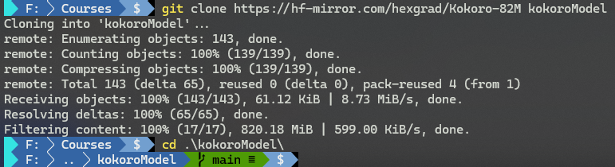

**图 1：模型下载完毕后进入项目根目录后的实测命令截图**


### 3.2. 用 Anaconda 安装依赖

打开 `Anaconda Prompt (anaconda3)` 命令行工具，通过 `conda` 命令新建并激活虚拟环境 `kokoro`（环境名自拟）：

```bash
# 查看当前环境列表
> conda env list

# conda environments:
#
base                *  C:\Users\ad\anaconda3
myenv                  C:\Users\ad\anaconda3\envs\myenv

# 新建 kokoro 环境
> conda create --prefix D:\conda_venvs\kokoro python=3.12
# 配置自定义虚拟环境所在路径
> conda config --add envs_dirs D:\cuda_venvs
# 切到 kokoro 环境
> conda activate kokoro
# 确认当前环境
> conda env list

# conda environments:
#
base                   C:\Users\ad\anaconda3
myenv                  C:\Users\ad\anaconda3\envs\myenv
kokoro               * D:\conda_venvs\kokoro
```

然后在新环境下安装 `Jupyterlab`，以确保项目依赖和 `Jupyterlab` 都在同一个环境下：

```bash
> conda install jupyterlab
```

再按官方文档提供的示例代码，安装其他依赖 `phonemizer`、`torch`、`transformers`、`scipy`、`munch`：

```bash
> pip install -q phonemizer torch transformers scipy munch
```

由于要用到 `CUDA` 的模型能力生成语音，所以还需要安装 `PyTorch`。先访问 `PyTorch` 的官方文档，在快速入门页面（`https://pytorch.org/get-started/locally/`）选择适合本机的参数，然后复制到 `Anaconda` 命令行中：

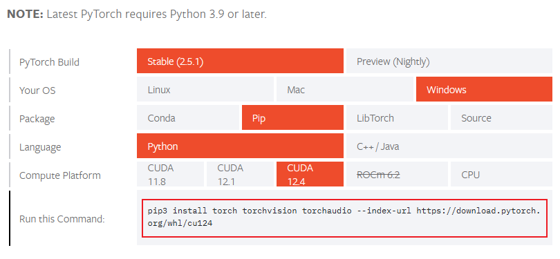

**图 2：PyTorch 官方文档提供的快速安装选项卡**

我本机的安装命令如下：

```bash
> pip3 install torch torchvision torchaudio --index-url https://download.pytorch.org/whl/cu124
```


### 3.3. 手动安装 espeak-ng 依赖

要在 `Windows` 本地运行 `Kokoro-82M` 模型，还需要手动安装一个叫 `espeak-ng` 的依赖项，否则会报错 `RuntimeError: espeak not installed on your system`：

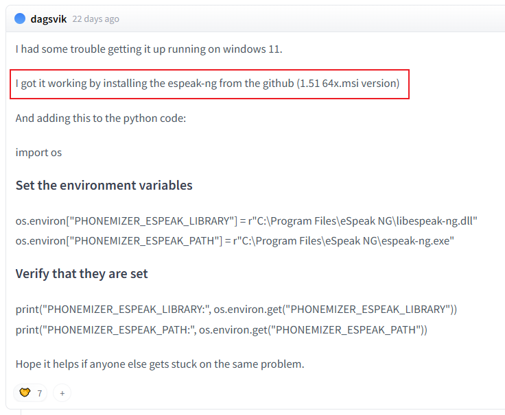

**图 3：HuggingFace 热心网友分享的 Windows 版 espeak-ng 依赖安装攻略**

前往 `espeak-ng` 的官方 `GitHub` 库地址 `https://github.com/espeak-ng/espeak-ng`，根据截图中的版本（`1.51 64x.msi`）下载安装包，在本地直接默认安装即可：

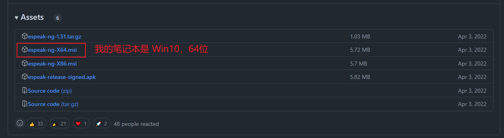

**图 4：根据网友提示在 GitHub 找到对应版本的 espeak-ng 的 Windows 安装包**


### 3.4. 启动 Jupyterlab

由于提前安装好了所需依赖，官网提供的第一步可以直接跳过：

```python
# 1️⃣ Install dependencies silently
!git lfs install
!git clone https://hf-mirror.com/hexgrad/Kokoro-82M
%cd Kokoro-82M
!apt-get -qq -y install espeak-ng > /dev/null 2>&1
!pip install -q phonemizer torch transformers scipy munch
```

用 `Anaconda` 命令行导航到项目根目录，然后启动 `Jupyterlab`：

```bash
# 我的本地项目在 F:/Courses/kokoroModel
(D:\conda_venvs\kokoro) C:\Users\ad>F:
(D:\conda_venvs\kokoro) F:\>cd Courses\kokoroModel
# 启动 Jupyterlab
(D:\conda_venvs\kokoro) F:\Courses\kokoroModel>jupyter lab .
```

执行上述命令后，浏览器会默认打开 `http://localhost:8888/lab?`：

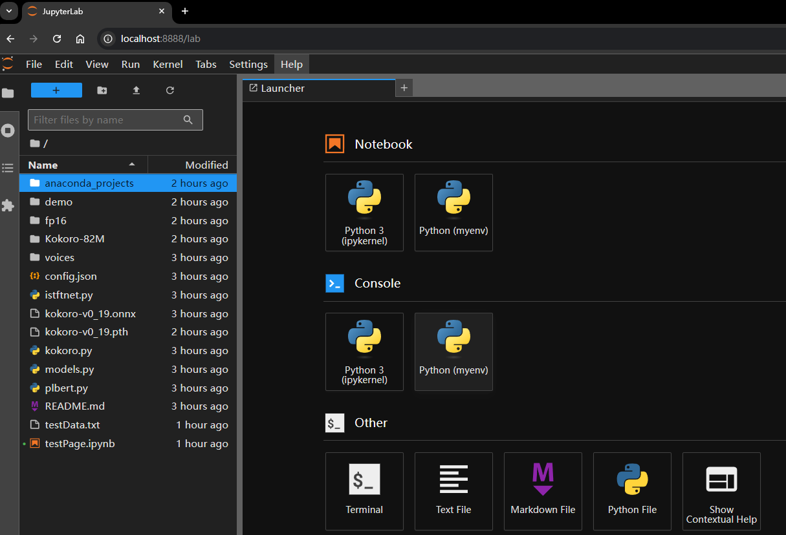

**图 5：用 Jupyterlab 打开项目看到的首页截图**


### 3.5. 运行测试脚本

新建一个 `Notebook` 文件，例如 `testPage.ipynb`（左上角 `File` :arrow_right: `New` :arrow_right: `Notebook​`），从官网提供的测试脚本的第二步开始运行（警告信息不用在意）：

```python
# 2️⃣ Build the model and load the default voicepack
from models import build_model
import torch
device = 'cuda' if torch.cuda.is_available() else 'cpu'
MODEL = build_model('kokoro-v0_19.pth', device)
VOICE_NAME = [
    'af', # Default voice is a 50-50 mix of Bella & Sarah
    'af_bella', 'af_sarah', 'am_adam', 'am_michael',
    'bf_emma', 'bf_isabella', 'bm_george', 'bm_lewis',
    'af_nicole', 'af_sky',
][0]
VOICEPACK = torch.load(f'voices/{VOICE_NAME}.pt', weights_only=True).to(device)
print(f'Loaded voice: {VOICE_NAME}')
```

运行结果如下：

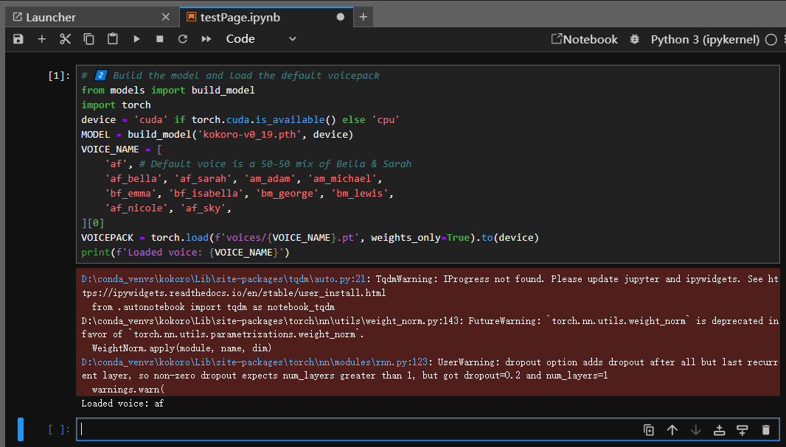

**图 6：新建记事本文件，直接从第二段脚本运行的实测效果图**

然后根据官网提供的 `espeak-ng` 配置脚本（详见 `https://github.com/bootphon/phonemizer/issues/44#issuecomment-1540885186`），先运行模型作者本人推荐的这段代码：

```python
from phonemizer.backend.espeak.wrapper import EspeakWrapper
_ESPEAK_LIBRARY = 'C:/Program Files/eSpeak NG/libespeak-ng.dll'
EspeakWrapper.set_library(_ESPEAK_LIBRARY)
```

实测结果如下（没有消息就是好消息）：

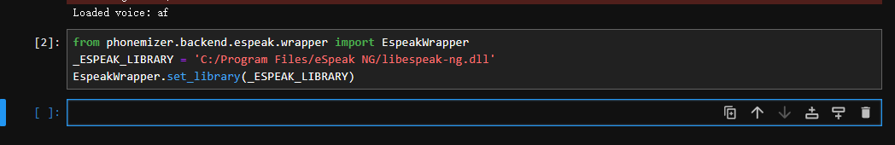

**图 7：手动配置 espeak-ng 依赖的脚本执行情况**

最后再把官方提供的后两段代码粘进去运行，就能听到本地实时生成的 TTS 语音了：

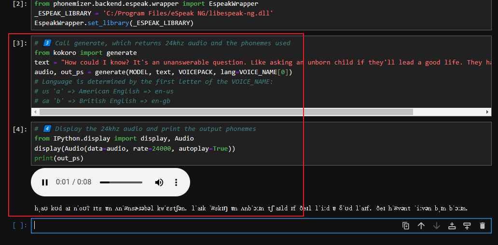

**图 8：安装官方文档在本地成功运行测试脚本的效果图（语音文件生成后自动播放）**

附：`HuggingFace` 官网提供的最后两步完整测试脚本如下：

```python
# 3️⃣ Call generate, which returns 24khz audio and the phonemes used
from kokoro import generate
text = "How could I know? It's an unanswerable question. Like asking an unborn child if they'll lead a good life. They haven't even been born."
audio, out_ps = generate(MODEL, text, VOICEPACK, lang=VOICE_NAME[0])
# Language is determined by the first letter of the VOICE_NAME:
# 🇺🇸 'a' => American English => en-us
# 🇬🇧 'b' => British English => en-gb

# 4️⃣ Display the 24khz audio and print the output phonemes
from IPython.display import display, Audio
display(Audio(data=audio, rate=24000, autoplay=True))
print(out_ps)

```


## 4 关于 Truncated to 510 tokens 问题

实测时发现，将 `text` 改为其他较长文本，语音会自动截取为 510 token 长度，使得无论文本内容多长，最后的语音都只有 8 秒：

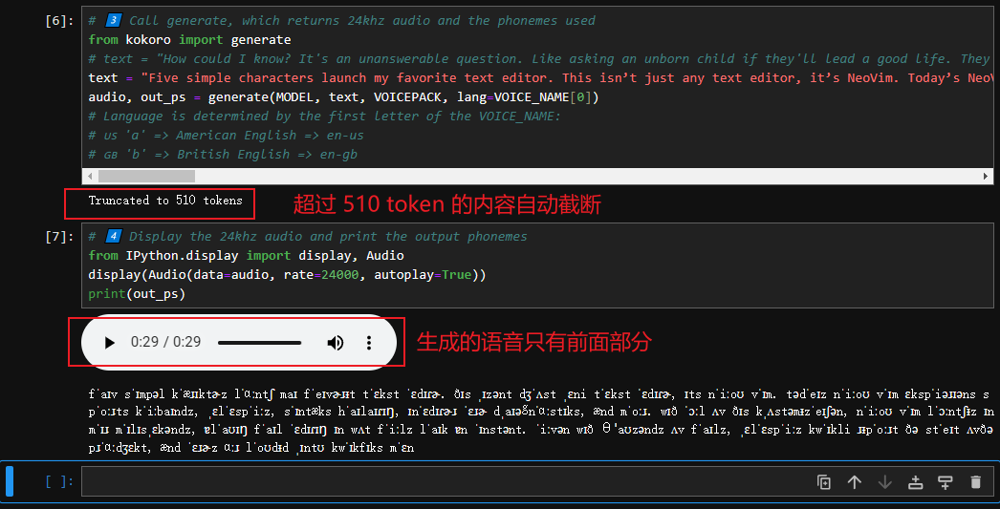

**图 9：自动截断文本内容的 Truncated to 510 tokens 问题**

究其原因，在于 `kokoro.py` 模块中的 `generate` 方法人为限制了 token 的长度：

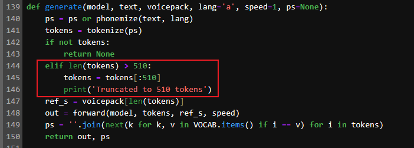

**图 10：generate 方法中人为限制了 token 数的最大长度**

此时只要改为下方的 `generate_full` 方法就可以了：

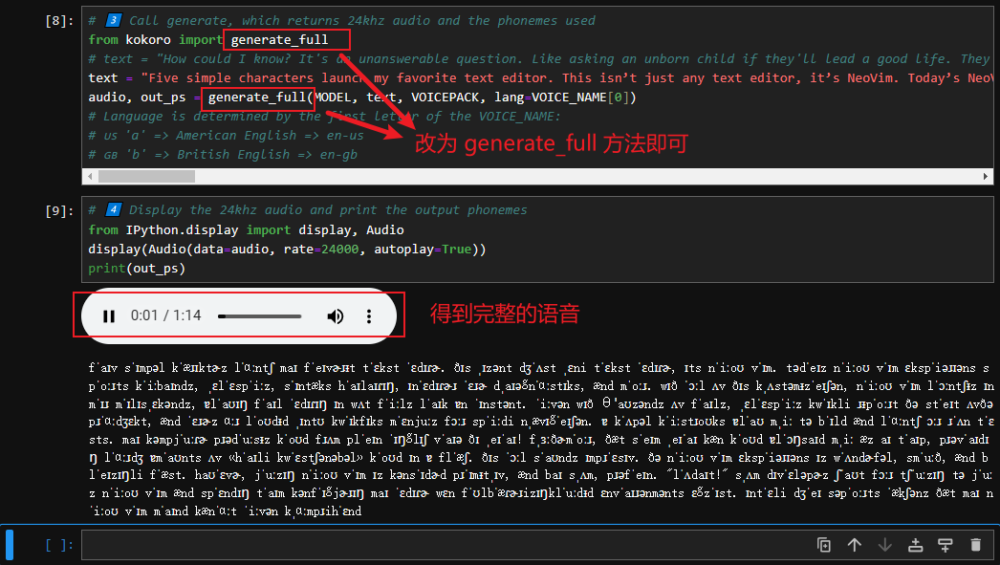

**图 11：改用 generate_full 方法后，token 自动截断的问题就搞定了**


## 5 其他注意事项

由于 `Kokoro-82M` 完全开源免费（遵循 apache-2.0 协议），除了上面发现的 token 截断问题，还可以根据需要自行改造。比如从一个文本文件读取内容，或者换成其他声音源（即变量 `VOICE_NAME` 的取值），还可以根据模型接口创建一个前端操作界面……由于我也是刚学 `Python` 不久，就不在这里班门弄斧了。部署过程中用到的 `Git` 仓库和 `espeak-ng` 依赖，秉承开源精神，我也一并放到百度网盘供大家免费下载（要是上传 CSDN 平台还必须加贡献币，有违开源精神）：

网盘地址：`https://pan.baidu.com/s/1tKRWsy18mi-t3guSWvYI5Q`
提取码: `rk55`

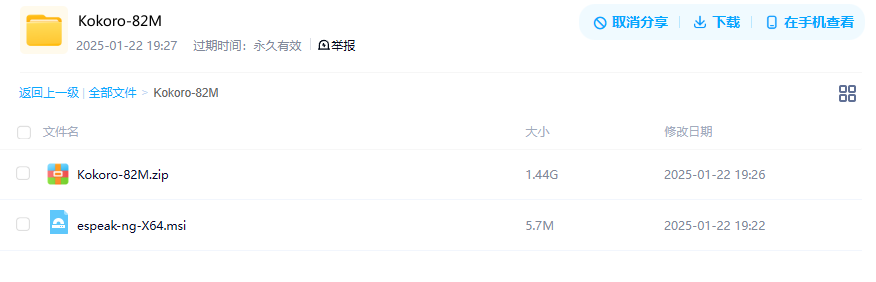

**图 12：本地部署所需工具、代码库的网盘分享截图**

