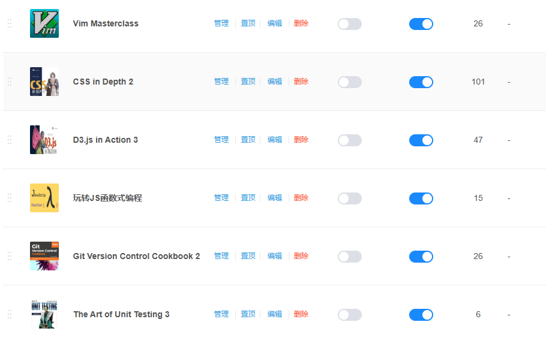

# 【CSDN 博客之星主题文章】稳扎稳打，拥抱未来 —— 我的 2024 年度回顾与新年展望

---

## 1 前言

要不是今天收到 CSDN 的系统通知，我还以为主题文章最后的截稿日期是 24 号的 23:59:59。本来计划给我的《Vim Masterclass》专栏来个完美收尾的，谁知计划赶不上变化，赶紧再开一个线程来完成这篇半命题作文。

说来惭愧，自从转行做了 IT 码农，这还是我第一次如此正式地在平台上对自己一年的经历进行总结。如果要用一个关键词来形容 2024 这一年，那它一定是刚才讲过的 “计划赶不上变化”：从 2023 年底的暴走裸辞、到合伙创业的红海拼杀、再到大健康赛道的小试牛刀、下半年 All in AI 的迷思与沉淀……过去的这一年多我经历的每一个人生重要事件，都像极了当下如火如荼、瞬息万变的 AI 头条事件。我不敢保证自己的经历有多少可供分享或借鉴的所谓 “干货”，但眼下也是时候静下心来盘点盘点一路走来的得失与体会了。因为我始终坚信，I'm not alone.

我的这篇年度报告可能不会以经典的 “总分总” 模式构建，这大概也是我当年拼命逃离央企机关 “八股” 材料的直接原因。我希望在这篇总结中注入一些有生命力的东西，一些过了很多年也会让心灵有所触动的东西。

## 2 关于离职

一直以来，我给周围同事老板的印象都是稳重、老练、考虑周全、顾全大局之类的标签；直到 2023 年 11 月的生日那天，我才猛然意识到，自己居然就这样走过了 36 个春秋：每天几乎两点一线的生活，频繁穿越于各大城市医疗卫生的幕后一线，经常是忙到很晚才发现外卖已在门卫架子上凉透了；通勤路上也恨不得把每时每刻都利用起来充实自己的技术栈，以应对无穷无尽地技术难题和磨人耐性的一切工作琐碎。终于，我收到了来自体检医生的郑重警告：年轻人，再不注重健康问题，下一步不是脑梗就是心源性猝死，你自己选吧……而医生面对的这个刚过 35 岁的 “年轻人”，当时正饱受严重失眠的困扰，经常凌晨三四点被毫无征兆的心绞痛、或者莫名的心悸驱散一整晚本就不多的睡意。终于，我主动关闭了多年来的 Buff 模式，选择在公司本部 “休养生息” 一段时日。

可好景不长，随着大量老员工的流失，公司招人青黄不接的问题愈发严重，我从工作之余顺带面试技术变成了后来的主抓面技术，顺带搞搞项目。到甲方催得紧的那几天，又不得不恢复 Buff 模式，回家远程熬到两三点的工作日常中……到年底时还听到消息，开年可能要常驻外地支援甲方项目建设。另外，本部新来的小领导总觉得我工作不努力，明里暗里搞办公室政治，拉拢这个疏远那个，让本就脆弱的开发团队几近支离破碎。现在的身体状况已经等不到公司主动辞退我的那天了，几次高层易主也让刚来公司时的活跃气氛荡然无存。考虑再三，我选择了裸辞，想着先好好调养身体，年后再谋出路。

## 3 关于焦虑

突然没了收入来源，头两个月还很不以为然，每天日出而作，日落而息，天气好的时候还可以散散步、游游泳，生活那叫一个滋润。一个偶然的机会，我从一个亲戚打听到一款减肥产品，说是对我的脂肪肝很有好处。抱着试一试的心态（这话术迷之熟悉），我体验了一下推荐的保健品，别说还真管用，大概过了两周，失眠和心绞痛的问题就大幅改善了，于是又买了第二批产品继续吃保养。其间还和他们的人一起参加了徒步 40 公里的户外有氧活动，认识了不少 “圈内” 的大佬。聊天中提到大健康，这和我疫情期间的思考不谋而合：大健康 + 互联网或 AI，一定是未来的主流趋势。于是脑门一热，又投了些钱，开始探索用 AI 大语言模型处理日常事务：产品信息整合、自动生成简报、PPT、利用 ASR 做会议纪要……每一天都是新的尝试，都会收获意外的惊喜。

但漫无目的地试错和为爱发电的幸福感终归短暂，随着积蓄的逐渐见底，之前的所谓轻资产创业促销活动并没有收到实质性的入账，身边的很多人都是围观满足了一下好奇心就默默离开了，留下最多的都是些精神鼓励。另一边，两笔应收账款因为盲目相信对方直接打了水漂，让我不得不奔走在工作室和法院之间。看着法院长长的讨债队伍，我那仨瓜俩枣在众多债权人眼中就是个没苦硬吃的另类笑话。要债之旅的艰辛和停滞不前的创业项目，让我陷入了深深的焦虑之中。虽然有电影《热辣滚烫》的神助攻，但心情也像过山车，恢复得快，跌落得更快。《凡人歌》里那句 “终日奔波苦，一刻不得闲” 大排档高歌更是让我一度破防。

就这样又过了三个月，当我再次拿到当地医院递来的体检报告，成功减肥 16 斤、顺利摆脱十多年脂肪肝束缚的我，却怎么也高兴不起来。只因为我把个人创业想得过于简单了。李笑来在他的畅销书《自学是门手艺》里专门谈到过焦虑的问题，我十分认同。所谓的贩卖焦虑不过是个安慰自己的谎言罢了：难道别人不贩卖自己就不焦虑了吗？痛恨别人贩卖焦虑无非是对自己能力不足寻找的借口，也是对自己草率行事又无力承担后果的最好托词。“要是……的话，实在不行就……” 成了我那段时间的新口头禅，一路伴我去社区当志愿者，去给熟人帮帮忙，再去各大平台海投简历……因为所有的努力都带着非常明显的 “凑合” 的味道，结果也可想而知。

## 4 峰回路转

进入六月，在数以百计的简历投递石沉大海后，一个小小的热伤风感冒又对我按下了暂停键。这次我选择了摆烂：做什么都提不起兴致，每天吃了就睡，睡醒又吃，无聊就把武侠小说翻出来躲在书房里打发时间，不愿意出门，更不愿意家里来人。

说来也巧，正是这段摆烂啃小说的废柴时光，让我偶然找到了治愈焦虑的 “良药”。

那是盖聂对年幼的荆天明的一句教诲：……天资过人又足够勤奋的话，十年，大抵可以有所成就了。

没想到就是这么平平无奇的一句话，竟让我惊出一身冷汗，并且反思了从当年的央企离职、再到现在的私企离职的所有拿得出手的 “大事件”。它们的背后都有一个基本事实被我忽略了很多年——我在几乎所有关键的问题节点采取的一贯态度都是 **浅尝辄止**。我也突然想起小学老师跟我说过的 “不要满足于现状” 的醒目评语；想起了第一次主动离职前机关领导找我谈话时劝我 “暂避锋芒” 的良苦用心；也想起了 40 公里徒步活动结束当晚、大佬在庆功晚宴上跟我讲的 “三年入行、五年懂行、十年称王” 的肺腑之言……回过神来，竟已泪眼婆娑。

合上小说的瞬间，我似乎开启了《鬼灭》里的通透世界，仿佛周围的一切都静止了。

那一刻，我收获了内心真正的平静。

## 5 轻装上阵

治好了自己的心病，我的良好状态也慢慢回来了，很多事情的先后主次变得异常清晰：拒绝冲动创业，果断中止 “以己之短比人之长” 的愚蠢做法，同时积极跟进法院那边的进展但不依赖催收的进度，将自己的主要精力放在软件领域，深耕下去。6 月 12 号，我重新恢复了在 CSDN 更新博文的习惯，接连开辟了好几个一直想复盘的技术专栏：

**图 1：重拾自我后在 CSDN 平台陆续开辟的技术专栏**

因为我是拿到过结果的，所以比别人更清楚取与之道：

> **凡取与，贵分晓；与宜多，取宜少。**
>
> ——《弟子规》

也正是秉承开源共享的理念，“疫情” 期间我挤出休息时间梳理并发表了一篇在 `Windows Server` 安装 `MySQL` 时解决一个典型报错的完整 [攻略文章](https://blog.csdn.net/frgod/article/details/104173102)，可能也是因为问题明确、行文简洁、所需资料完全免费而广受好评，阅读数和点赞量成了当年的最佳文章。也是从那个时候起，我逐渐树立起了对开源的信心。而这些年在一线奋斗，由于各种原因未能将踩过的坑、扫过的雷、搭过的桥认真复盘并整理出来，无形之中也让我陷入了只见树木不见森林的窘境而不自知。如果当时能及时调整，坚持复盘，相信一定可以对一些大的趋势评判得更加理智与客观，也能让后来者少走很多弯路。

很久不写技术博客的我，刚开始恢复写作也十分吃力，完美主义让我第一篇原创文章光是开头就要想大半天。但我并不过分苛责自己，因为这是重拾信心的必由之路，更新高质量的技术博客少不了这样的笨拙与耐心。就这样，在发表了大概五六篇博文后，我对写作的感觉慢慢上来了，并逐渐尝试把一些大家容易忽视的关键技术摘出来更新到专栏里，这就是《`D3.js in Action 3`》专栏的创立初衷。因为很多人听说过 `D3.js` 的强大，但碍于国内 `ECharts.js` 的垄断地位和 `D3.js` 异常陡峭的学习曲线，不得不敬而远之。而这本由 **Manning** 出版社最新推出的《`D3.js in Action`》第三版刚好可以解决入门难的问题，为大家及时分享这本书的好处就显得很有必要了。

但更新进行了一周，我发现自己前端看似什么都会点，其实对基础的掌握是千疮百孔的，这一点在 `CSS` 上尤为突出。为了打好头阵，我又入手了最新版的《`CSS in Depth`》这本 CSS 进阶神作，通过通读、精译、代码实操、延伸阅读多管齐下的方式，持续深耕 CSS 基础。头一个月是最难熬的，整理笔记经常感觉腰酸背痛。后来有了沉浸式翻译插件的帮助，翻译的 `v1.0` 问题基本解决了，`v2.0` 及以上的润色优化还得自己亲自操刀。到后来慢慢对 CSS 有了感觉，逐渐有了把玩 CSS 样式的意味，学起来也没那么枯燥了，还能把它们都纳入自学笔记中。之前看默语大佬写的文章，谈到写出高质量博文的关键，在于 **注重细节、结合案例**，对此深表赞同。这本 500 来页的新版神作，就是在这样的思路下完成所有内容的整理和翻译的。从文章收到的反馈来看，这样的努力是非常值得的。现在再到社区浏览有关 CSS 的文章，我能明显感觉到整个知识体系的强力支撑，而这都是持续付出时间和精力的自然而然的结果，来不得半点水分。

虽然已经很注意时间预算管理了，但实施过程中也是一波三折。比如《`CSS in Depth 2`》专栏原计划是四个月之内完成，结果写了两个月右肩旧伤复发，不得不停工理疗，顺带调整战略：集中精力先完成一个专栏，再更新其他的。因为当时同步新建了好几个专栏，每天凭兴趣更新，时间过半《`CSS in Depth 2`》才更新到大概三分之一，照这样下去到年底也未必能更完。于是，我采取了每天连更两篇的硬性指标。只要时间安排得当，两篇 2000 到 4000 字左右的博文还是没问题的。

但计划还是赶不上变化。11 月中旬父亲突发肾结石，在医院陪护了一周。重新接上专栏更新又差不多花了一周时间。这样一来四个月写完专栏的任务就不可能实现了。但轻装上阵的意义就在这里，要懂得适时调整目标，不要给自己过重的心理包袱。于是改为年底前出完就好。为此，我还专门整理了每个小节的篇幅和大致用时，然后每天按部就班去更新，最后反而提前了两天拿下目标。这是我转行以来第一次凭借自学完成的第一个精译专栏，也是通过执行学习计划啃下的第一本 500 页以上的前端原版书籍，可谓意义非凡。

## 6 高处着眼，细处着手

有了精译《`CSS in Depth 2`》时旧伤复发的教训，我开始注意学习计划的张弛有度和良好写作习惯的培养。比如，每周给自己至少预留一天休息时间，并允许临时变更造成的计划延误；再比如，尽量先保证同一个专栏文章的高质量输入，尽量不要同时更新多个专栏；最后，时刻关注各大内容平台的技术动向，从热议的纯英文文章中获取第一手知识，每周必须完整阅读至少一篇纯英文前端博文。

也就是在读英文技术文章的过程中，我看到了由 `Ruby on Rails` 的创始人、业界大牛 **David Heinemeier Hansson** 热情洋溢地介绍 `Vim` 的 [一篇文章](https://blog.csdn.net/frgod/article/details/142445430)，也重新燃起了对 `Vim` 纯键盘操作的热情。掌握 `Vim` 之后，不仅省去了右手在键盘和鼠标来回切换的麻烦，更能让我保持高度专注，还能有效缓解肩部肌肉的疲劳损耗，可谓一举多得。更重要的是，`Vim` 是我最新认定的程序员 **元技能** 之一。

所谓元技能，就是能让开发者巩固自身地位，确保基业长青的底层基础技能。这些技能要么是和代码关联甚少的思维认知方法论，要么是一些久经考验的基础工具、基础技术。而 `Vim` 就是后者中的佼佼者。特别是面对 AI 浪潮的冲击，从 2023 年 3 月 15 日起，我就有意识地在思考，AI 巨变之下，像我们这样的面向应用层的开发者又该何去何从？经过反复摸索和确认后，这个问题最近终于有了些眉目，概括起来就是以下几点：

- `AI` 不会完全取代开发者，至少现阶段还不会彻底取代软件开发工作；
- 与其焦虑 `AI` 带来的威胁，不如主动拥抱 `AI`；
- 面对瞬息万变的 `AI` 头条，开发者应该有不动如山的定力，进一步打造专属 **元技能**；
- 这些 **元技能** 包括但不限于：逻辑抽象能力、清晰概括能力、正确提问的能力、持续精进底层核心技术栈的能力；
- 未来开发者的职业生涯规划要 **高出着眼、细处着手**：从机械重复的编码工作中主动抽离出来，用第一性原理回归问题本质，然后集中优势兵力找准突破口，尽快拿出 MVP（Minimum Viable Product，最小可行性产品）；
- 未来的开发者将是最有可能成为 “六边形战士” 的 **超级个体**：有了代码和 AI 智能体的强大加持，其他领域的知识壁垒将不复存在；
- `Cursor` 也好，`Windsurf` 也罢，看似 **一键走你** 的背后，都离不开对软件需求与问题的准确描述，而精准的提示词技巧离不开对底层代码和 **元技能** 的深刻洞察，因此这些明星 **IDE** 将注定是 **AI** 浪潮下的现象级产品。

……

总之，AI 浪潮之下，开发者前些年积攒的知识与技能不可能一夜之间毫无价值，反而会让开发者综合素质的竞争持续升温。从这个视角来看，未来初阶程序员的数量大幅锐减、产品经理的人数激增、但同时优秀产品经理长期空缺的局面很可能成为国内软件开发的 **新常态**。

类似这样的小结论还有很多，我会继续观察，持续完善上述观点。

## 7 关于读书

2024 年另一个值得一提的，是我的闲书阅读。之前迫于工作需要，我的大部分阅读量都和软件编程的一线工具书相关。但它们严格意义上讲并不是真正的书，只是印刷版的工具而已。也要感谢去年的特殊经历，读到了几本相当不错的书，这里做个简要回顾：

- 《伟大的博弈》：看过这本书再来看国内 A 股市场，就会淡定很多；历史给人类的最大教训，就是人类从不吸取历史教训。
- 《相信》：这是我离职时送给同事的另类 “伴手礼”（请客吃饭推杯换盏实在不是我的风格），也让我了解了蔡磊的传奇故事。此人几乎是屏借一己之力，强势推动了国内渐冻症科研事业数十年的发展，相信今后的历史终将为他的 “壮举” 再添浓墨重彩的一笔。
- 《人生由我》：这是埃隆马斯克的母亲、梅耶马斯克的自传。马斯克传奇的人生经历可以从她母亲的这部自传中获得新的启发。优秀如梅耶马斯克，也同样会经历人生中的各种不堪，从这个意义上讲，这个世界也是公平的。欲戴皇冠者，必承其重。
- 《脉络》：这本书应该是吴军博士复盘这些年演讲、授课过程中的思维火花的系统梳理。因为某些观点过于新颖，豆瓣上也难免遭到个别喷子的非议。吴军博士对当今社会热点问题的深入思考，以及以西方工业文明为主线的宏大叙事手法给人留下了极其深刻的印象。对于未来文明与科技的走向预判具有一定的参考价值。
- 《自学是门手艺》：李笑来写于六年前的又一本畅销书，以独特视角介绍 `Python` 的正确打开方式，并以此佐证自学能力的培养本质上也是在打造一门手艺。这是我第三次通读全书，但这一次是认真精度所有内容，并结合 `GitHub` 上的电子版对书中所有内容进行了实操与校对，才重新发现了很多遗漏的“彩蛋”内容。可惜电子版三年前停止维护了，否则随着 AI 的持续爆火，这本书很有可能会再版发行。
- 《疯狂的尿酸》：这是上半年备考公共营养师的课外阅读材料之一，书中详细阐述了尿酸在人体代谢过程中的各种副作用，很多研究成果都刷新了人们的认知。比如果葡糖浆给人体带来的危害。最后还给出了系统降尿酸的解决方案，对于培养良好的饮食习惯和生活方式很有帮助。
- 《贪婪的多巴胺》：这是一本被很多人误读的小册子。多巴胺和内啡肽近年来似乎成了两个死对头，其实读到后面的内容才知道多巴胺也不只是急功近利只看眼前的代名词，它也设计长远规划和持续动力。书中有很多有趣的思想实验，可以更好地理解两位作者的观点。
- 《白夜行》：这是清理二手书时才下决心翻完的一本奇书，和电影电视剧的叙事手法完全不同。书中主人翁甚至连一句正式对话都没有，但所有的碎片到最后又能巧妙地彼此关联，浑然天成。这也是东野圭吾一贯的创作风格，看完原著再来反观电视剧和电影，感觉导演们的二次创作也非常成功，值得国人学习。

## 8 关于未来

前事不忘后事师。过去的 2024 年于我而言可谓跌宕起伏、险象环生。所幸，我没有被眼前的困境和 “大环境不景气” 的各种谎言击溃，相反在失业创业双双遇阻的日子里逐渐找回了自我，重拾了信心。很喜欢蔡磊写的那本《相信》。面对不确定的未来，我们应该拿出一个真正的人应该有的精气神，相信相信的力量，直到 AI 造福人类的光芒真正降临到你我身边。