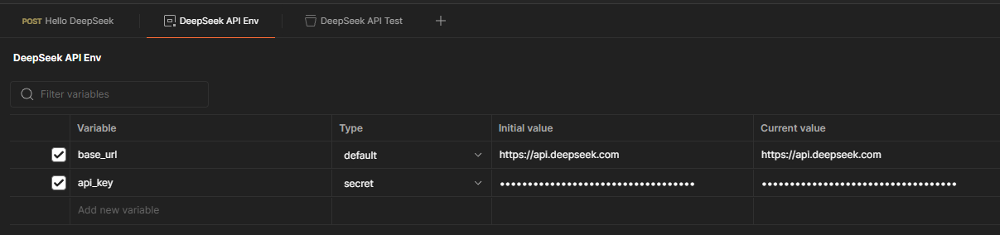
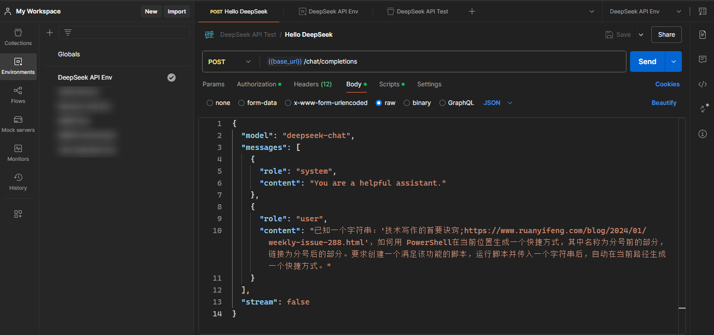
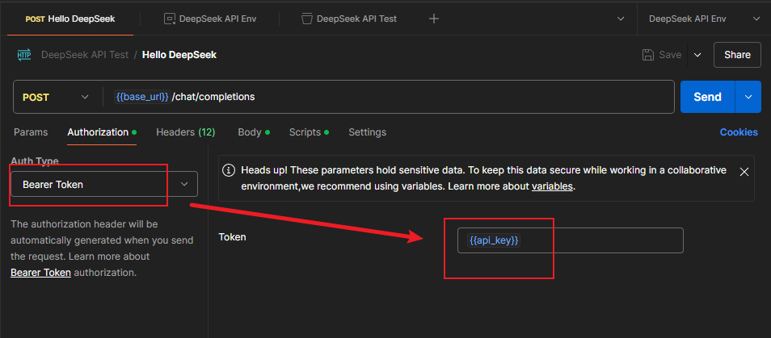
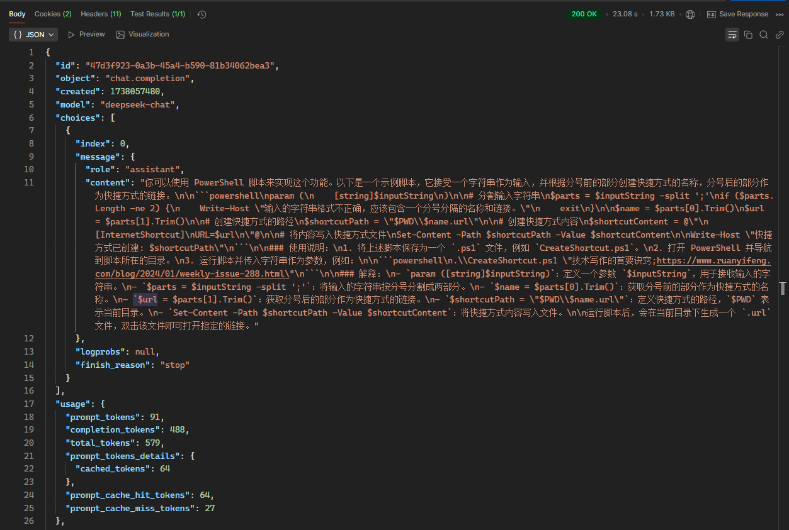
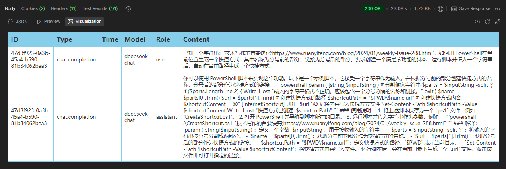
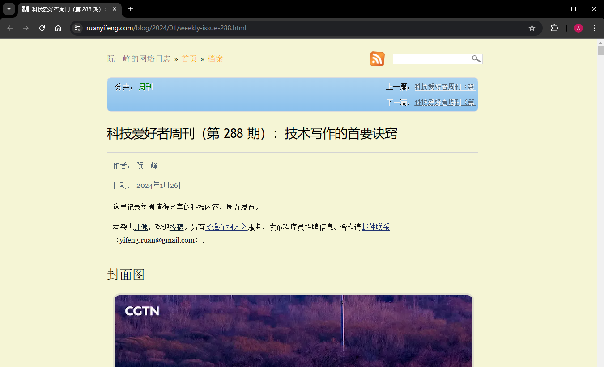
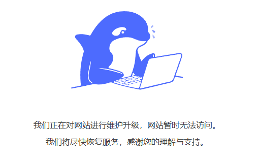
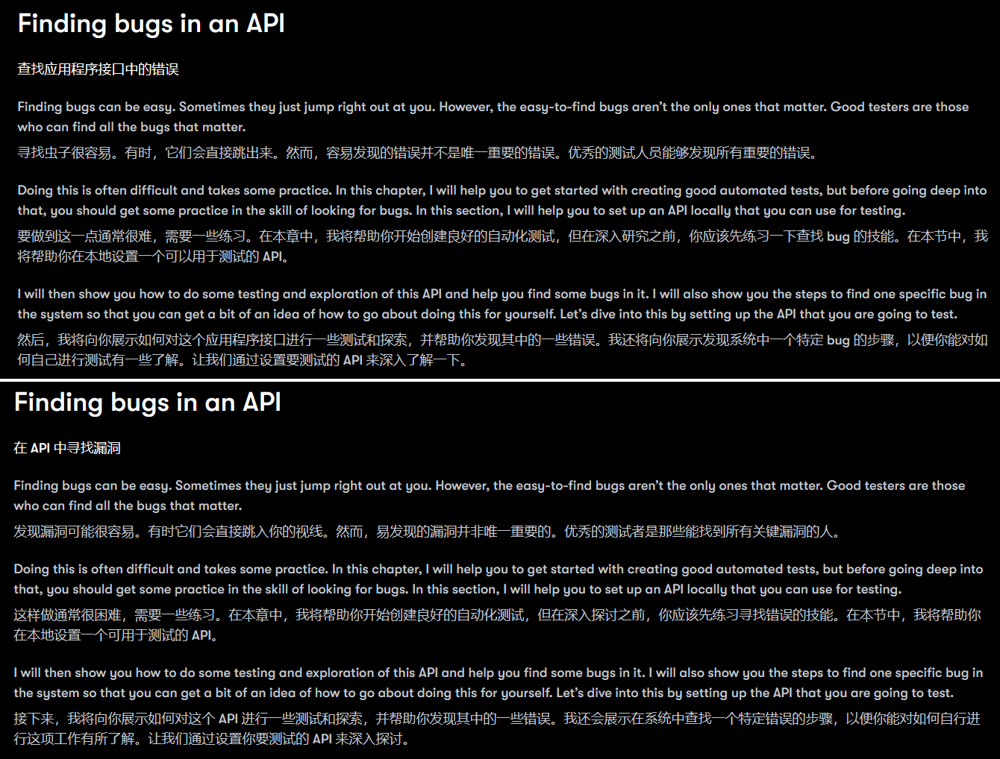
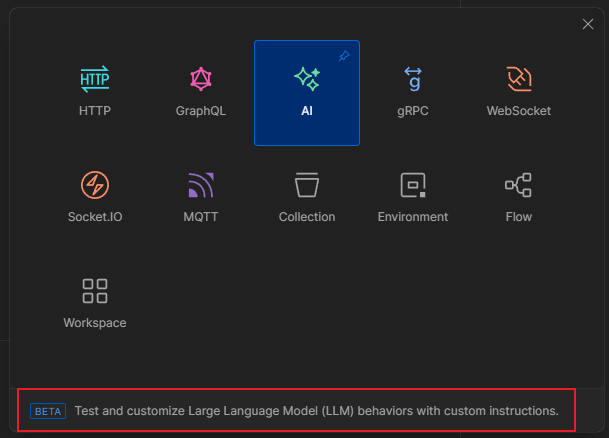
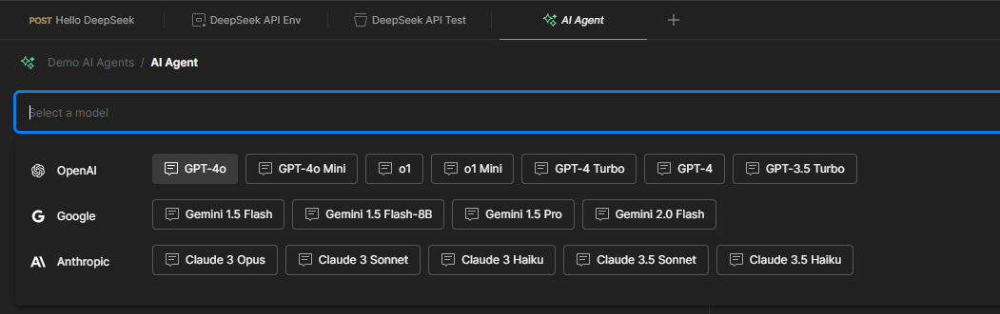

# DIY1：用 Postman 调用 DeepSeek 接口生成 PowerShell 脚本

---

## 1 前言

今天是大年三十，`DeepSeek` 的新闻热度感觉比春晚还要火爆。正好最近在学 `Postman`，就拿 `DeepSeek` 的 `API` 接口练练手，帮我实现一个用 `PowerShell` 生成本地快捷方式的小任务。


## 2 需求描述

这个需求来自前段时间刚养成的一个阅读习惯。对于网上偶然看到的一些有意思的博文或视频，但又没时间仔细阅读，我通常会在桌面上创建一个快捷方式，而不是直接放到浏览器收藏夹——因为对我来说，像这样放进去的链接大概率是不会再看第二眼的，“等以后有时间再看” 往往就是 “永远没时间再看”。但另存为桌面快捷方式不一样，下次打开笔记本我会强迫自己至少读完一个，并且读完就删，这样在收藏时就会多考虑考虑，可有可无的文章就不创建了。别说，效果还挺好。

每次创建快捷方式都要重复很多鼠标操作：创建快捷方式、然后分别复制粘贴网址和文件名。于是就想用一个 `PowerShell` 脚本完成半自动化操作：运行这个脚本，然后指定一个固定格式的字符串参数，就能在桌面上自动创建超链接。


## 3 具体实现

说干就干。先到 `DeepSeek` 开放平台 `https://platform.deepseek.com/` 注册一个帐号（注册成功就有 10 元抵用额度，第一印象不错），然后生成一个 `API Key` 备用。

然后在 `Postman` 新建一个测试集合 `DeepSeek API Test`，以及一个与之关联的测试环境 `DeepSeek API Env`（名称自拟）。在新环境中定义两个变量：

- `base_url`：`https://api.deepseek.com`
- `api_key`：`<your API key>`



**图 1：DeepSeek API Env 测试环境的变量定义**

接着新建一个 POST 请求 `Hello DeepSeek`，`URL` 设为 `{{base_url}}/chat/completions`，并指定 `Content-Type` 请求头为 `application/json`，然后在请求的 `Body` 正文中输入以下内容：

```json
{
  "model": "deepseek-chat",
  "messages": [
    {
      "role": "system",
      "content": "You are a helpful assistant."
    },
    {
      "role": "user",
      "content": "已知一个字符串：'技术写作的首要诀窍;https://www.ruanyifeng.com/blog/2024/01/weekly-issue-288.html'，如何用 PowerShell在当前位置生成一个快捷方式，其中名称为分号前的部分，链接为分号后的部分。要求创建一个满足该功能的脚本，运行脚本并传入一个字符串后，自动在当前路径生成一个快捷方式。"
    }
  ],
  "stream": false
}
```

注意，这里的 `stream` 参数用于控制响应的返回方式，开启后将以流的形式返回结果。这里没必要，保持默认的 `false` 即可：



**图 2：创建 DeepSeek 对话测试请求**

最后，在 `Authorization` 标签完成 `Bearer` 鉴权后，就能发送请求了：



**图 3：在 Authorization 标签完成 Bearer 鉴权**

点击发送按钮，稍等片刻，就拿到了 `DeepSeek` 的响应结果：



**图 4：DeepSeek 给出的 JSON 响应内容**

这时可以用 `Postman` 自带的可视化模块 `Visualization` 生成一个简单的表格：



**图 5：利用 Postman 内置的 AI 助手对响应结果进行的可视化处理（第一行是我自己加的，微调一下生成的模板即可）**

具体的测试脚本如下：

```js
pm.test("Status code is 200", function () {
    pm.response.to.have.status(200);
});

var template = `
<style type="text/css">
    .tftable {font-size:14px;color:#333333;width:100%;border-width: 1px;border-color: #87ceeb;border-collapse: collapse;}
    .tftable th {font-size:18px;background-color:#87ceeb;border-width: 1px;padding: 8px;border-style: solid;border-color: #87ceeb;text-align:left;}
    .tftable tr {background-color:#ffffff;}
    .tftable td {font-size:14px;border-width: 1px;padding: 8px;border-style: solid;border-color: #87ceeb;}
    .tftable tr:hover {background-color:#e0ffff;}
</style>

<table class="tftable" border="1">
    <tr>
        <th>ID</th>
        <th>Type</th>
        <th>Time</th>
        <th>Model</th>
        <th>Role</th>
        <th>Content</th>
    </tr>
    <tr>
        <td>{{res.id}}</td>
        <td>{{res.object}}</td>
        <td>{{res.createTime}}</td>
        <td>{{res.model}}</td>
        <td>{{user.role}}</td>
        <td>{{user.content}}</td>
    </tr>
    <tr>
        <td>{{res.id}}</td>
        <td>{{res.object}}</td>
        <td>{{res.createTime}}</td>
        <td>{{res.model}}</td>
        <td>{{msg.role}}</td>
        <td>{{msg.content}}</td>
    </tr>
</table>
`;

function constructVisualizerPayload() {
    const json = pm.response.json();
    const msg = json.choices[0].message;
    const bd = JSON.parse(pm.request.body.raw);
    const usr = bd.messages[1];
    return {res: json, msg, user: usr};
}

pm.visualizer.set(template, constructVisualizerPayload());
```


## 4 结果验证

为了验证 `DeepSeek` 对话模型给出的答案，将回复正文放到 `Typora` 解析一下，就得到了这段代码：

```powershell
param (
    [string]$inputString
)

# 分割输入字符串
$parts = $inputString -split ';'
if ($parts.Length -ne 2) {
    Write-Host "输入的字符串格式不正确，应该包含一个分号分隔的名称和链接。"
    exit
}

$name = $parts[0].Trim()
$url = $parts[1].Trim()

# 创建快捷方式的路径
$shortcutPath = "$PWD\$name.url"

# 创建快捷方式内容
$shortcutContent = @"
[InternetShortcut]
URL=$url
"@

# 将内容写入快捷方式文件
Set-Content -Path $shortcutPath -Value $shortcutContent

Write-Host "快捷方式已创建: $shortcutPath"
```

再按照提示另存为 `CreateShortcut.ps1` 脚本文件放到桌面上，用以下命名进行测试：

```powershell
> ./CreateShortCut.ps1 '写作的首要诀窍;https://www.ruanyifeng.com/blog/2024/01/weekly-issue-288.html'
快捷方式已创建: C:\Users\ad\Desktop\写作的首要诀窍.url
> 
```

这样，桌面就看到了这样一个快捷方式：


**图 6：实测 DeepSeek 给出的 PowerShell 脚本生成的快捷方式**

双击打开，顺利打开该示例页：



**图 7：由 DeepSeek V3 聊天接口提供的 PowerShell 脚本成功创建本地快捷方式并正常打开该页面**


## 5 注意事项

截至发稿时，`DeepSeek` 的平台接口页又崩了，一直报 `503` 错误：



**图 8：DeepSeek 接口首页又崩了**

等后面恢复了再补一张接口消费 `token` 的统计图表，自费真的很亲民。利用赠送的 10 元额度，我又把刚学完的《**API Testing and Development with Postman**》第二版第 11 章的内容让 `DeepSeek` 全文翻译（放到沉浸式翻译插件中测试）。感觉很多地方比 `DeepL` 翻的质量还要好，阅读起来非常流畅。这时当时节选的对比图：



**图 9：DeepL（上）和 DeepSeek（下）在长文翻译场景下的对比效果图**

另一个对 `Postman` 来讲比较打脸的事实是，1 月 22 号官方才大力宣传的 AI 智能体创建模块还不支持 `DeepSeek` 模型：



**图 10：通过 Ctrl + N 看到的还在试验阶段的 Postman AI 创建模块**



**图 11：Postman AI 模块目前支持的大模型（截至 2025 年 1 月 28 日）**

后续随着 AI 学习的深入，我还将继续分享 `DeepSeek` 等模型的本地应用，敬请期待！