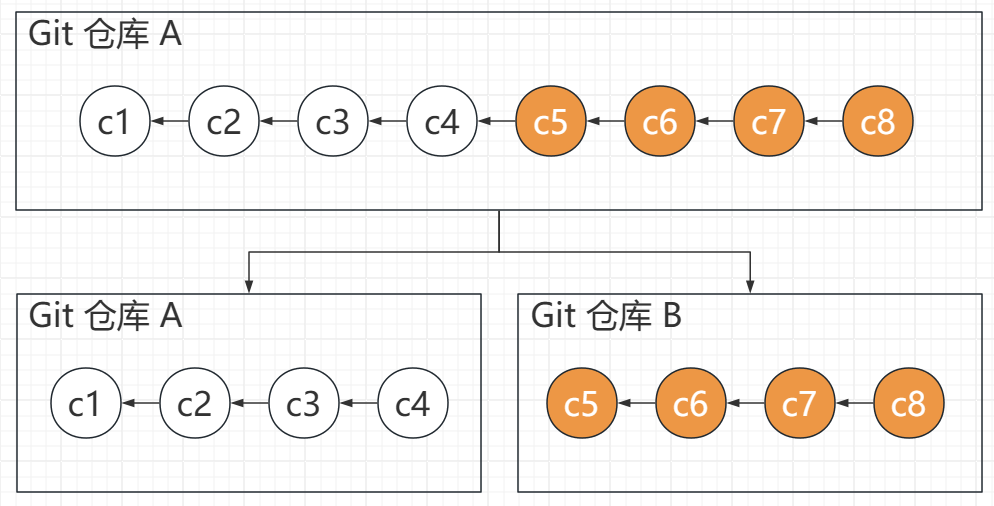
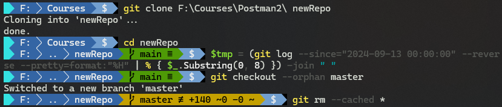
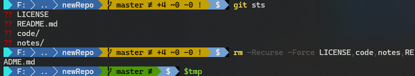
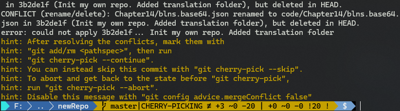
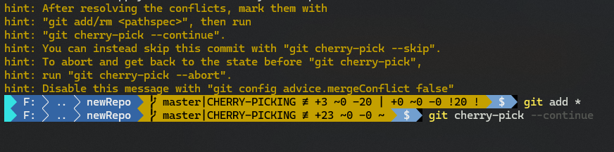
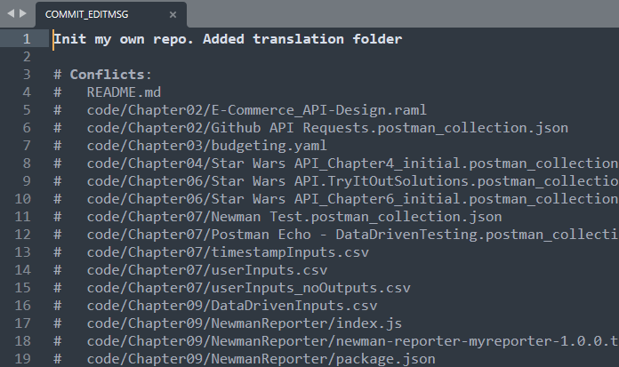
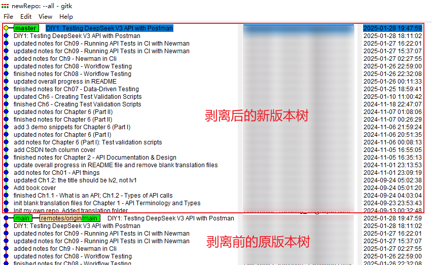
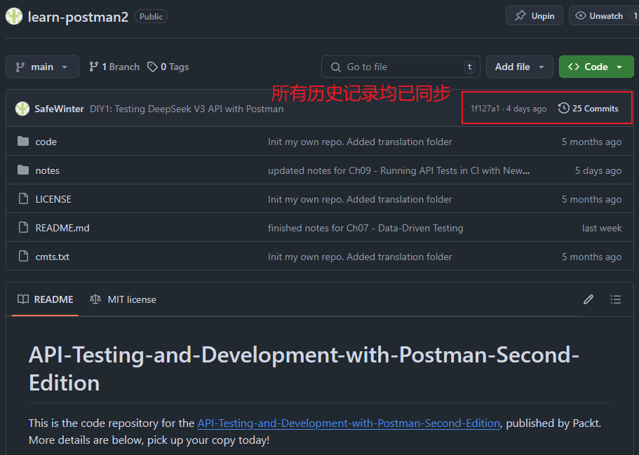

# 利用 DeepSeek 实现复杂 Git 操作

---


## 1 背景介绍

今天综合利用 DeepSeek V3 和 R1 推理模型，成功解决了一个复杂的 Git 操作，谨以此文记录 DeepSeek 使用心得，以备后续复盘。这本是我一次操作上的疏漏，未能将 Fork 到本地的代码与原项目彻底脱钩，直到很晚才发现问题，已经很难快速用简单的 Git 命令恢复原样了。于是，我想到了 DeepSeek。


## 2 需求描述

现有一个从 `GitHub` 复刻（fork）到我本地的开源项目。从复刻到本地那天起，我又陆续在 `main` 分支提交了很多次（没有其他分支）。现在需要将我本人提交的所有节点从该副本完整迁移到另一个新仓库，并要求保留所有节点的历史提交记录（提交时间、注释信息等）。



**图 0：迁移 Git 子版本树的需求描述示意图**


## 3 思路分析

该需求涉及从原 `Git` 库彻底剥离需要的子版本树。`Git` 还没有能一步实现节点树 “脱钩” 的操作命令。但大方向是明确的，无非以下四步 ——

1. 先找到脱钩位置（简单）；
2. 从脱钩点产生一个新的 `Git` 根节点（未知）；
3. 设法将脱钩点后续产生的提交版本依次追加到新的根节点上（未知）；
4. 最后删除原有版本树，重置远程推送分支 `origin`（简单）；

以上四步逻辑关系清晰，正好可以用 `DeepSeek` 一试身手。


## 4 实现过程

### 4.1 第一次需求确认

因为涉及多次复杂 `Git` 操作，先用 `V3` 网页版直接提问（刻意未加任何提示词技巧）：

> 我有一个本地 Git 代码仓库，是从 GitHub 一个开源项目上 fork 到本地的，但这样产生的提交不计入 GitHub 网站的个人贡献，因此我在提交了很多本地新增的版本后决定将其剥离出来。但我不知道应该怎么操作。帮帮我

以下是整理后的 `DeepSeek V3` 的回复，可以看到 `V3` 模型第一次理解有偏差：

> 要将本地 `Git` 仓库从 `GitHub` 的 `fork` 中剥离出来，使其成为一个独立的仓库，并保留所有提交历史，可以按照以下步骤操作：
>
> ```bash
> # 1. 备份当前仓库
> # 2. 移除与上游仓库的关联：
> cd /path/to/your/repo
> git remote remove origin
> # 3. 创建新的 GitHub 仓库（不要初始化 README 或 .gitignore）
> # 4. 将本地仓库关联到新仓库：
> git remote add origin https://github.com/yourusername/new-repo-name.git
> # 5. 推送代码到新仓库：
> git push -u origin --all
> git push -u origin --tags
> # 6. 确保本地分支跟踪新的远程分支：
> git branch --set-upstream-to=origin/main main
> ```
>

要是按上述回复进行操作，其实只是把远程分支更新到了新仓库，完全没有实现想要的“脱钩”效果。


### 4.2 第二次需求确认

继续追问：

> 如果只想保留部分提交历史，比如只有我自己的提交历史，又该如何？

这次它听懂了，但给出的方案是借助第三方工具（由于不是理想回复，具体内容已精简）：

> ```bash
> # 1. 安装 `git filter-repo`
> pip install git-filter-repo
> # 2. 为避免直接操作原始仓库，建议先备份
> git clone /path/to/your/repo new-repo
> cd new-repo
> # 3. 通过以下命令保留只有你提交的历史：
> git filter-repo --commit-callback '
> if b"your-username" not in commit.committer_email:
>     commit.skip()
> '
> # 4. 清理远程信息
> git remote remove origin
> # 5. 创建新的 GitHub 仓库 new-repo-name
> # 6. 关联新仓库并推送
> git remote add origin https://github.com/your-username/new-repo-name.git
> git push -u origin --all
> git push -u origin --tags
> # 7. 效果验证（略）
> ```

由于需要安装第三方依赖，解决方案的可移植性较差。因此还需继续追问。


### 4.3 第三次需求确认

由于我想要的是 `Git` 原生命令，因此再次追问：

> 我不想安装第三方工具，Git 没有原生方法实现吗？

这次它终于听懂了，想到了孤立分支（`--orphan`）和 `cherry-pick` 节点提取命令 ——

>  如果你不想安装第三方工具（如 `git filter-repo`），Git 本身也提供了原生方法来实现部分提交历史的保留，但操作会稍微复杂一些。以下是使用 Git 原生命令实现的方法：
>
> ```bash
> # 1. 克隆你的本地仓库
> git clone /path/to/your/repo new-repo
> cd new-repo
> # 2. 创建一个新的分支
> git checkout --orphan new-branch
> # 3. 筛选并重新提交你的更改
> # 从提交历史筛选想要的提交哈希值：
> git log --author="your-username" --oneline
> # 逐个挑选提交
> git cherry-pick <commit-hash>
> # 如果需要挑选多个提交，可以将哈希值列出来：
> git cherry-pick <commit-hash-1> <commit-hash-2> <commit-hash-3>
> # 4. 清理旧分支
> git branch -D main  # 删除旧的主分支
> git branch -m new-branch main  # 将新分支重命名为主分支
> # 5. 清理旧的远程分支
> git remote remove origin
> # 6. 创建新的 GitHub 仓库
> # 7. 关联新仓库并推送
> git remote add origin https://github.com/your-username/new-repo-name.git
> git push -u origin main
> # 8. 验证
> ```

这里 `DeepSeek` 还漏掉了一个关键细节：`cherry-pick` 在遇到多个 `commit` 版本时需要严格遵守先后顺序。在我进一步的提示下，它才补全了这部分内容，并且给出了发生冲突时的解决方案，但比较官方：

> 如果在挑选提交时发生冲突：
>
> 1. Git 会暂停挑选过程，并标记冲突文件。
>
> 2. 手动解决冲突后，使用以下命令继续：
>
>    ```bash
>    git add <resolved-files>
>    git cherry-pick --continue
>    ```
>
> 3. 如果你想跳过当前提交（例如冲突无法解决），可以使用：
>
>    ```bash
>    git cherry-pick --skip
>    ```
>
> 4. 如果你想取消整个挑选过程，可以使用：
>
> ```bash
> git cherry-pick --abort
> ```


### 4.4 V3 模型：中间结果的处理

由于 `git log` 命令得到的 `commit` 顺序是从新到旧，与 `cherry-pick` 相反，因此可以让 `DeepSeek` 帮我获取正确排序的哈希列表。这类简单任务 V3 完成得很好：

```bash
# 1. 逆序输出提交历史
git log --reverse
# 2. 筛选指定日期之后的提交
git log --since="2024-09-13 00:00:00"
# 3. 只保留哈希值
git log --pretty=format:"%H"
# 4. 组合命令
git log --since="2024-09-13 00:00:00" --reverse --pretty=format:"%H"
# 5. 解释参数
# --since="2024-09-13 00:00:00"：筛选出指定日期之后的提交。
# --reverse：将提交历史从最旧到最新排列。
# --pretty=format:"%H"：只输出提交的哈希值。
```

为了节省时间，我将最后的 `PowerShell` 命令作了进一步格式化处理，只保留 `SHA1` 哈希值的前八位，并用空格进行分隔：

```powershell
(git log --since="2024-09-13 00:00:00" --reverse --pretty=format:"%H" | % { $_.Substring(0, 8) }) -join " "
```


### 4.5 方案验证，首站告捷

然后按照最后一次需求确认的结果，尝试用 `--orphan` + `cherry-pick` 来实现：

```bash
# 备份到新文件夹，再行处理
> git clone F:\Courses\Postman2\ newRepo
Cloning into 'newRepo'...
done.
> cd newRepo
# 获取待迁移节点列表（从早到晚排序）
> $tmp = (git log --since="2024-09-13 00:00:00" --reverse --pretty=format:"%H" | % { $_.Substring(0, 8) }) -join " "
# 从 main 分支切到孤立分支 master
> git checkout --orphan master
# 移除暂存区（stage）内的所有提交内容
> git rm --cached *
```

最后这步是为了清空当前工作区内的无关变更，以便执行 `git cherry-pick` 命令：



**图 1：切到孤立分支 master 后，移除暂存区（stage）内的所有提交内容**

之后就可以删除工作区内的冗余内容了（除了 `.git` 文件夹保留，其余均可删除）：

```bash
# 查看当前待删文件（夹）
> git status -s
?? LICENSE
?? README.md
?? code/
?? notes/
> rm -Recurse -Force LICENSE,code,notes,README.md
```



**图 2：清空工作区内的所有无关内容**

然后就可以放心执行 `git cherry-pick` 了：

```bash
# 批量执行节点迁移
> $tmp
3b2de1fe e8f40cf3 1b02df31 00988a80 b0718962 a29d52c5 71ccc45b 1b0c9af2 24f0bdf5 d77cf64b c6be7f0b a0284fa4 bd0b88f3 3c548a07 e713024c 3b792f58 e29381e8 8cff3c5b 2ae4c28d 11887a88 254d26c7 125356db e6fead8b 2413c3b7 bfdf3bee
> git cherry-pick 3b2de1fe e8f40cf3 1b02df31 00988a80 b0718962 a29d52c5 71ccc45b 1b0c9af2 24f0bdf5 d77cf64b c6be7f0b a0284fa4 bd0b88f3 3c548a07 e713024c 3b792f58 e29381e8 8cff3c5b 2ae4c28d 11887a88 254d26c7 125356db e6fead8b 2413c3b7 bfdf3bee
# ...
error: could not apply 3b2de1f... Init my own repo. Added translation folder
hint: After resolving the conflicts, mark them with
hint: "git add/rm <pathspec>", then run
hint: "git cherry-pick --continue".
hint: You can instead skip this commit with "git cherry-pick --skip".
hint: To abort and get back to the state before "git cherry-pick",
hint: run "git cherry-pick --abort".
hint: Disable this message with "git config advice.mergeConflict false"
> 
```

但是按默认的合并方式，会得到很多冲突报错，中断命令：



**图 3：批量执行 cherry-pick 后出现一堆冲突文件**

此时只需要用 `git add *` 命令直接将其标记为已解决，就能继续了：



**图 4：手动处理冲突内容，并继续 git cherry-pick 操作**

接着，`Git` 会自动弹出本轮操作的提交注释页，询问是否需要修改注释内容。这里无需修改，直接关闭即可：



**图:5：批量操作后的提交界面（无需修改，直接关闭即可）**

最后，再用 `gitk --all` 命令查看版本树，新的子版本树就诞生了：



**图 6：利用 gitk --all 查看当前所有版本树，新的子树（上方）已经生成完毕，且历史提交日期不变**

处理完最复杂的两步后，剩下的都是些简单的收尾工作：

```bash
# 删除本地旧分支 main
> git branch -D main
Deleted branch main (was bfdf3be).
# 删除远程跟踪分支 origin
> git remote remove origin
# 分支 master 重命名为 main
> git branch -m master main
# 新建目标仓库，重置远程跟踪分支
> git remote add origin git@github.com:SafeWinter/learn-postman2.git
# 推送到远程仓库
> git push -u origin main
```

这样就实现了 `Git` 子版本树的完整迁移：




## 5 总结复盘

上述操作过程看似一气呵成，其实中途有很多次微调没有记录，这里略作复盘：

1. `DeepSeek` 延续了 “遇强则强” 的大模型风格，要想得到满意的答复，提问者除了精准描述问题外，还需要对相关领域有扎实的基础；否则 `DeepSeek` 只会跟着你的思路，无法立即看出问题的根源所在；
2. 一旦需求明确后，`DeepSeek` 往往能很快提供准确回复，且该方案准确率极高（`--orphan` + `cherry-pick` 组合）；这种感觉就像是在和付费版 `ChatGPT 4x` 对话，但又是完全免费使用，非常震撼；
3. 务必重视 `R1` 模型的推理过程，这是后续大幅提高准确率的关键。`R1` 模型会将当前会话的历史记录全部导入推理过程，十分智能；
4. 建议大家还是多用网页或手机版 DeepSeek，能在本地部署的都是完整模型的蒸馏版，虽然无需联网交流，但表现是大打折扣的；与其跟风“大炼钢铁”，不如多用 `DeepSeek` 解决一些实际问题；
5. 本文介绍的版本树剥离方案还存在一个问题：各历史节点的提交时间和作者修改不一致——前者为当前操作时间，后者为历史记录时间 [^1]。要让提交时间也回归到历史节点，只能从历史节点中提取提交时间，然后逐一提交。但这样的单独处理，只要存在对原内容的修改，当次 `cherry-pick` 操作就会中断，且必须手动处理内容冲突，`DeepSeek` 暂时无法给出包含手动处理版本冲突的自动化脚本，只能给出没有中断的情况下每次迁移的自动化脚本（如下所示）。要实现彻底自动化，还需要提问者自身对 `bash` 脚本或 `PowerShell` 脚本有相当程度的透彻理解。

```bash
# runcommit.ps1
param(
    [Parameter(Mandatory=$true, Position=0)]
    [string]$CommitHash
)

# 获取作者日期和提交日期
$AUTHOR_DATE = git show -s --format=%aI $CommitHash
$COMMITTER_DATE = git show -s --format=%cI $CommitHash

# 设置环境变量
$env:GIT_AUTHOR_DATE = $AUTHOR_DATE.Trim()
$env:GIT_COMMITTER_DATE = $COMMITTER_DATE.Trim()

# 执行 cherry-pick
git cherry-pick --keep-redundant-commits --allow-empty $CommitHash
# 运行方法：.\runcommit.ps1 commit_SHA_value (Enter)
```


---

[^1]: 该问题在浏览器查看历史提交记录时才会出现，`GitHub` 目前只能按实际提交时间排序，而 `Gitee` 则可以选择排序方式。相比之下，国产的 `Git` 托管平台在展示历史提交方面更有优势。

