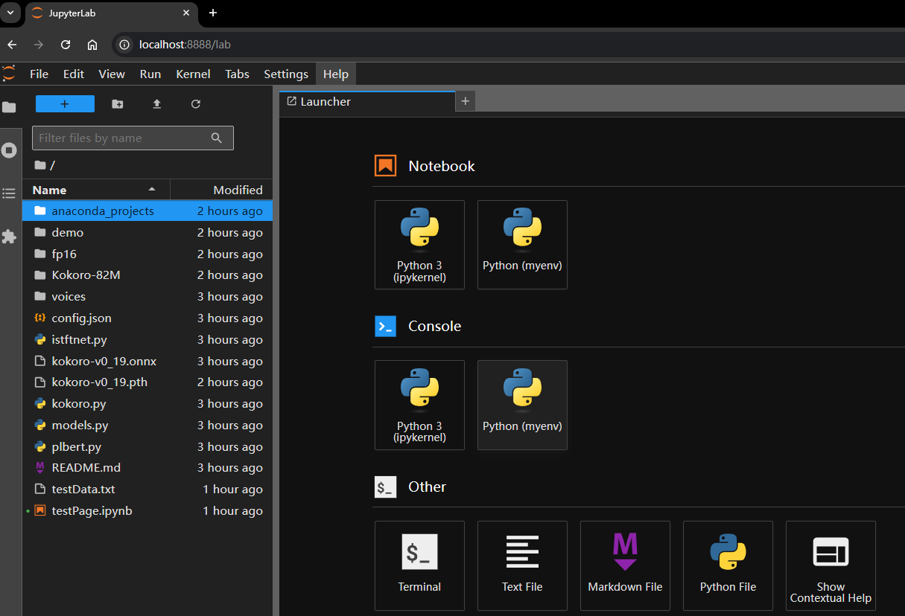

# 2025 年实现听书自由——基于 Kokoro-82M 的开源 TTS 工具 audiblez 本地部署实战


## 1 前言

`Kokoro-82M` 是一款今年 1 月刚开源的轻量级文字转语音 `TTS` 智能模型（详见 [HuggingFace 测试页](https://huggingface.co/spaces/hexgrad/Kokoro-TTS)），因为其模型参数规模小、语音生成质量高、项目完全开源免费等特点而迅速火爆全网。经过多方查证与实际演练，我也成功跑通了本地部署流程并第一时间发了一篇 `Kokoro-82M` [实战笔记](https://blog.csdn.net/frgod/article/details/145309601 "点击查看笔记详情")。但当时只能借助 `Jupyterlab` 实现小范围的文本转换，如果要生成电子书级别的完整语音还是比较吃力：



**图 1：利用 Jupyterlab 成功实现 Kokoro-82M 本地部署的主页面**

一个偶然的机会，看到 `GitHub` 有个英国的大佬基于 `Kokoro-82M` 开发了一个 `TTS` 开源项目，成功实现了在命令行中将 `epub` 电子书转换成高清语音。这不就是我一直想要的功能么？几经尝试，终于在我本地也跑通了 `1.0` 版。虽然最后的 `.m4b` 语音文件合成还没通，但利用 `GPU` 生成的大段 `.wav` 格式语音已经非常不错了：


**图 2：本地成功运行的 audiblez 可基于 epub 识别结果手动选择要转成语音的章节**


**图 3：原始版 audiblez 在最终合成 m4b 文件时失败（作者怀疑是中间某个依赖项的问题）**


**图 4：audiblez 在本地生成的 wav 高清语音文件均能正常播放**

时隔仅一个月，这个彩蛋级项目又新增了上百次提交，点赞数也从我刚开始关注的 800 多暴涨到 1800 多，最新版甚至推出了体验感更加友好的 `GUI` 界面，更新迭代速度快得离谱——


**图 5：最新版 audiblez 支持 GUI 可视化界面（截图为 MacOS 环境）**

有了这款 `TTS` 神器，今后所有的 `epub` 电子书都可以随意转成智能 `.wav` 格式的语音，从此实现听书自由。我随便放了几本开发类的正版 `epub` 文件，无论是发音还是语速、流利度、语感……几乎所有硬核指标都吊打目前市面所有的听书类 `APP`。因此，我决定将 `audiblez` 的本地部署方法分享出来，让那些打着各种名目高价收费的听书平台们好好反省反省。


## 2 本地部署准备工作

正式部署前先准备好以下工具：

1. `Git`：`v2.45.1`（能复制 `GitHub` 仓库就行）；
2. `Anaconda Prompt`：方便创建和管理 `Python` 虚拟环境；
3. `ffmpeg`：合成语音的必要依赖项（其 `bin` 目录须配置到系统环境变量 `PATH` 中）；
4. `torch` 模块：用于后期使用 `GPU` 加速。


## 3 具体安装步骤

经过多轮更新，目前 `audiblez` 工具的安装已经非常简单了，没有我第一次尝试部署的各种报错了，具体步骤如下：

```bash
# 启动 Anaconda Prompt
# 1. 创建 Python 虚拟环境 audiblez_new
> conda create --prefix D:\conda_venvs\audiblez_new python=3.12
# 2. 配置自定义虚拟环境所在路径
> conda config --add envs_dirs D:\conda_venvs
# 3. 切到 audiblez_new 环境
> conda activate audiblez_new
# 4. 确认当前环境
> conda env list

# conda environments:
#
base                   C:\Users\ad\anaconda3
audiblez_new         * D:\conda_venvs\audiblez_new
```

接着用 Git 将项目源码复制到本地（项目文件夹可以随意命名，这里我是为了和之前的纯命令行版，因此命名为 `audiblez_new`），并用 `pip install` 命令安装必要依赖：

```bash
# 1. 从 GitHub 克隆 audiblez 源码
> git clone https://github.com/santinic/audiblez.git audiblez_new
> cd audiblez_new
# 2. 安装 audiblez 必要依赖（全程点确认）
> pip install audiblez pillow wxpython
```

安装完成后，将待处理的 `epub` 电子书文件放到项目根目录下（例如 `book.epub`），然后执行命令：

```bash
> audiblez book.epub -v af_sky -s 1.0
```

上述命令中，`-s` 选项表示语速（speed），根据 `README` 文档，可以设为 `0.5` 到 `2.0` 之间的值；`-v` 选项用于指定声音源（voices），目前支持的声音源如下：

|      语言       | 声音源参数值                                                 |
| :-------------: | ------------------------------------------------------------ |
|   🇺🇸 美式英语   | `af_alloy`, `af_aoede`, `af_bella`, `af_heart`, `af_jessica`, `af_kore`, `af_nicole`, `af_nova`, `af_river`, `af_sarah`, `af_sky`, `am_adam`, `am_echo`, `am_eric`, `am_fenrir`, `am_liam`, `am_michael`, `am_onyx`, `am_puck`, `am_santa` |
|   🇬🇧 英式英语   | `bf_alice`, `bf_emma`, `bf_isabella`, `bf_lily`, `bm_daniel`, `bm_fable`, `bm_george`, `bm_lewis` |
|   🇪🇸 西班牙语   | `ef_dora`, `em_alex`, `em_santa`                             |
|     🇫🇷 法语     | `ff_siwis`                                                   |
|    🇮🇳 印地语    | `hf_alpha`, `hf_beta`, `hm_omega`, `hm_psi`                  |
|   🇮🇹 意大利语   | `if_sara`, `im_nicola`                                       |
|     🇯🇵 日语     | `jf_alpha`, `jf_gongitsune`, `jf_nezumi`, `jf_tebukuro`, `jm_kumo` |
| 🇧🇷 巴西葡萄牙语 | `pf_dora`, `pm_alex`, `pm_santa`                             |
|  🇨🇳 普通话中文  | `zf_xiaobei`, `zf_xiaoni`, `zf_xiaoxiao`, `zf_xiaoyi`, `zm_yunjian`, `zm_yunxi`, `zm_yunxia`, `zm_yunyang` |

如果本地支持 `GPU` 加速，还可以通过 `--cuda` 参数启用 `Cuda` 加速，语音合成时间比纯 `CPU` 合成至少快 10 倍。测试本机是否支持 `Cuda` 加速，可以使用以下 `Python` 脚本：

```python
> python
>>> import torch
>>> print(torch.cuda.is_available())
True
```

如果 Python 交互式环境的输出结果不是 `True`，则需要在当前虚拟环境安装 `Cuda` 支持：

```python
> pip install torch torchvision torchaudio --index-url https://download.pytorch.org/whl/cu124
```

这是根据我的本地情况从 `PyTorch` 官网自动生成的安装脚本命令，地址为：`https://pytorch.org/get-started/locally/`，从下列配置表中生成（具体参数配置方法可参考我的 [Kokoro-82M 实战笔记](https://blog.csdn.net/frgod/article/details/145309601) 对应内容）：


**图 6：PyTorch 官方文档提供的快速安装选项卡**

除了指定声音源、语速、`Cuda` 加速外，`audiblez` 还支持手动选择需要生成语音的章节，只需要再加一个 `--pick` 参数即可。

更多 `audiblez` 命令行参数用法，可参考 `audiblez --help`。


## 4 命令行启动测试

以源码中自带的原版《动物庄园》电子书为例（点击 [这里](https://archive.org/download/AnimalFarmByGeorgeOrwell/Animal%20Farm%20by%20George%20Orwell.epub) 免费下载），另存为根目录下的 `book.epub` 后，执行如下命令：

```bash
> audiblez book.epub -v af_sky -s 1.0 --cuda --pick
```


**图 7：audiblez 命令行运行实测截图**

之后会看到一个选择页面，供用户手动选择需要转成语音的章节（空格键用于勾选或取消勾选当前章节，`j` / `k` 或上下方向键用于上下移动光标，回车键用于最终确认）：


**图 8：从解析出的篇章列表手动选择待合成语音的章节**

这里选取任意三章，按回车键确认后，根据本机的硬件配置稍等片刻，直到运行结束：


**图 9：成功生成各章节 wav 音频和总的 m4b 音频文件后，audiblez 自动退出**

此时，项目文件夹下将看到这些音频文件：


**图 10：所有音频文件都将默认存到项目根路径下（也可以手动指定路径存放）**


## 5 GUI 界面启动测试

最新版 `audiblez` 还提供了 `GUI` 操作界面，只需在项目根路径的命令行下运行 `audiblez-ui` 命令即可。之后会弹出一个可视化窗口界面：


**图 11：最新版 audiblez 的 GUI 可视化操作界面效果图**

然后点击按钮加载根目录下的 `book.epub`，将看到如下操作界面：


**图 12：GUI 界面加载 epub 电子书后的功能示意图**


## 6 相关资源一站式下载

为了方便大家在本地快速搭建 `audiblez`，这里将本文提到的能提前下载的相关资源都整理到了我的网盘，包括：

1. `audiblez` 的 `GitHub` 源码仓库离线 `zip` 压缩包（方便 `git clone` 命令卡顿的朋友）；
2. `ffmpeg` 最新版安装包（解压到某个路径后，配置其 `bin` 目录到 `PATH` 环境变量即可）；
3. `Git` 最新版安装包（`v2.48.1`）；
4. `Anaconda` 最新 `Windows` 版（64 位）安装包；
5. 测试用的《动物庄园》`epub` 电子书 `Animal_Farm.epub`；

按照编号整理如下：


**图 13：本地部署 audiblez 所需的资料云盘汇总**

本着开源共享精神，没有套路，没有强制关注或加 VX，直接到这里下载即可——

链接：`https://pan.baidu.com/s/1xykYnpQr_zjVIThK3zR30g?pwd=92qn`
提取码：`92qn`

下载如有任何问题，可在评论区留言。欢迎各位多提宝贵意见，多多交流，共同进步！
