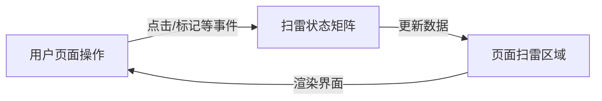
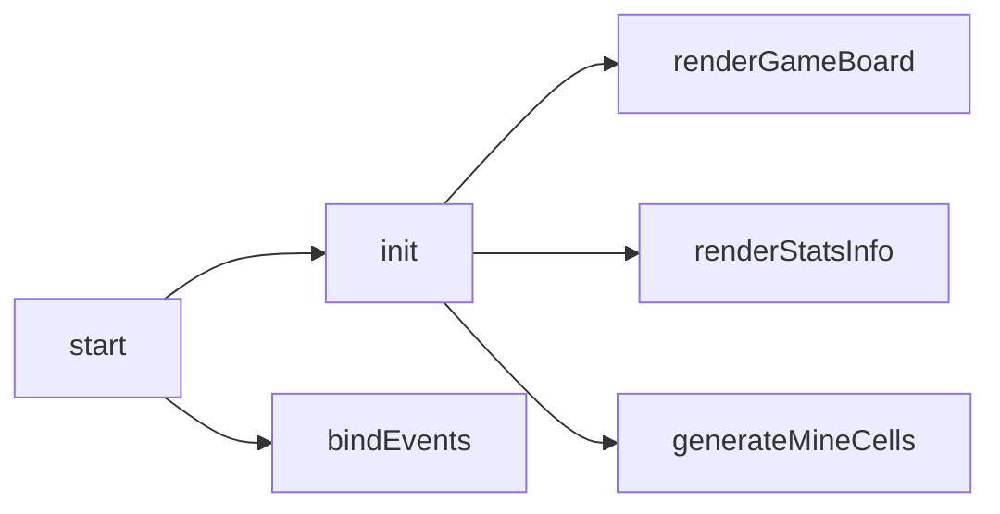
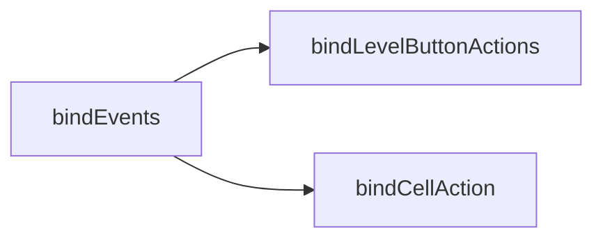
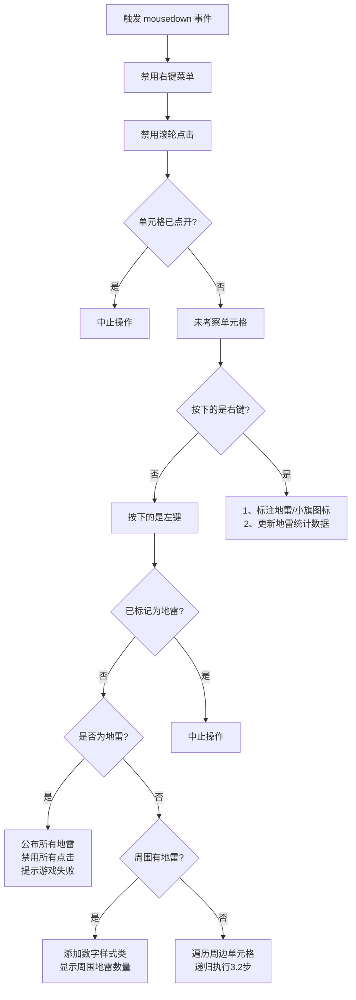
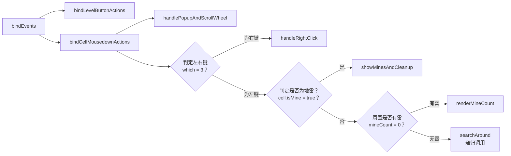
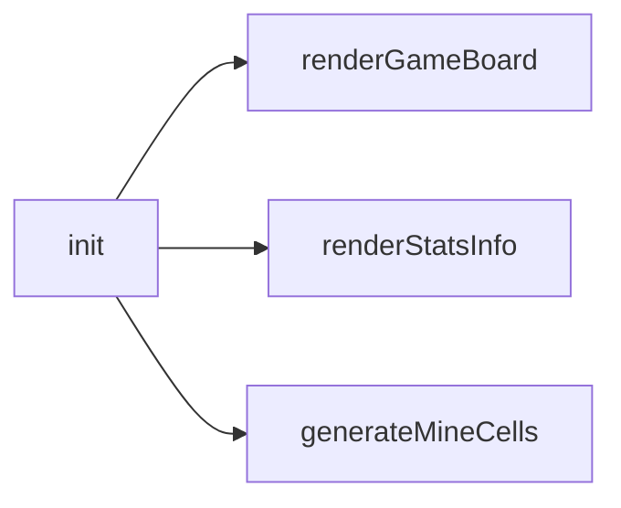
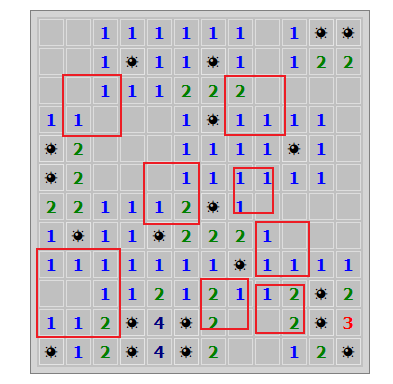

# DIY 实战：从扫雷小游戏开发再探问题分解能力

---

## 1 起因

最近在看去年刚出了第 2 版《**Learn AI-assisted Python Programming**》，梳理完 [第七章](https://blog.csdn.net/frgod/article/details/147366885) 的知识点后，总感觉这一章的话题很好——问题分解能力的培养——美中不足的是演示案例过于简单，有点意犹未尽。今天就用一个前端扫雷小游戏的全流程开发再来落地实操一回。

最终效果如下：


**图 1：前端扫雷游戏最终效果图**


## 2 思路分析

为了突出训练重点，这里将扫雷游戏略作简化，只保留核心功能：难度选择和扫雷操作，其他像计时、声音、排行榜等功能暂不考虑。因此整理后的需求描述如下：

1. 支持 “初级”、“中级”、“高级” 三种难度；
2. 记录每局总地雷数以及实时排雷数；
3. 根据选择的难度生成指定尺寸、固定地雷数的网格区域，通过左键探雷、右键标记地雷（不考虑 “待定” 标记）；
4. 探雷时：
   1. 如果踩到地雷则游戏结束；
   2. 为安全区域，则：
      1. 周围有雷：标记出周围 8 个单元格存在的地雷总数；
      2. 周围无雷：从当前单元格向四周扩散，直到发现标有地雷数的边界区域。
5. 排雷时，点击鼠标右键即可标记为雷区，之后左键无法单击继续；
6. 获胜条件：正确探明所有安全区域才算获胜（仅标注地雷不算胜出）。

那么按照上述需求，应该如何分类呢？每一局无论区域有多大，地雷有多少，都可以将整个界面剥离成两类问题：

1. 页面的渲染问题；
2. 页面元素的事件绑定问题；

接下来就围绕这两类问题进行讨论，看看问题分解如何发挥作用。


## 3 问题分解实战（自顶向下）

根据刚才的思路分析，页面渲染和事件绑定存在明显的先后顺序和依赖关系：渲染出页面后才能绑定事件，并且绑定事件还需要知道每个单元格的状态（即地雷数据）。于是可以设计出如下两个子函数：

```js
let currentLv = 0;

function start(lv = currentLv) {
    // init game board
    const mineCells = init(lv);

    // bind events
    bindEvents(lv, mineCells);
}

start(currentLv);
```

在对这两个任务做进一步分解前，需要先准备好游戏需要的静态页面。


### 3.1 静态页面与基础样式

这一步包括 `HTML` 基本结构和 `CSS` 基础样式。选型时为了更灵活地设置样式，选用了 `iconfont` + 样式类来实现所有的单元格图案和标记：


**图 2：游戏界面用到的主要图标字体（来源：阿里图标库）**

使用方法：

```html
<!-- 引入样式 -->
<link rel="stylesheet" href="./iconfont.css">
<!-- 设置图标 -->
<span class="mine ms-xxx"></span>
```

具体图标从阿里图标库选取即可，这里不多赘述。对照最开始给出的页面效果，再上网找出经典扫雷游戏需要的基本效果，于是有了如下两个文件：

`index.html`：

```html
<!DOCTYPE html>
<html lang="en">
<head>
    <meta charset="UTF-8">
    <meta name="viewport" content="width=device-width, initial-scale=1.0">
    <title>Mine Sweeper Game</title>
    <link prefetch rel="stylesheet" href="assets/font/iconfont.css">
    <link async rel="stylesheet" href="assets/css/index.css">
    <link async rel="shortcut icon" href="assets/favicon.png" type="image/x-icon">
</head>
<body>
    <div class="container">
        <h1>扫雷游戏</h1>
        <section class="level">
            <span>难度：</span>
            <button data-level="1" class="active">初级</button>
            <button data-level="2">中级</button>
            <button data-level="3">高级</button>
            <button class="restart hidden">重新开始</button>
        </section>
        <section class="stats">
            <div class="score">地雷数：<span id="mineCount"></span></div>
            <div class="time">已排除：<span id="mineFound"></span></div>
        <section class="game">
            <table class="gameBoard"></table>
        </section>
    </div>
    <script src="assets/js/index.js" type="module"></script>
</body>
</html>
```

以及对应的样式文件 `index.css`：

```css
* {
    margin: 0;
    padding: 0;
    box-sizing: border-box;
    font-family: Verdana, sans-serif;

    --cell-size: 25px;
}

.container {
    margin-inline: auto;
    text-align: center;
}

h1 {
    font-size: 1.7rem;
    margin-block: 1rem;
}

.level {
    padding: .5em 0;

    &>button {
        padding: .3em .7em;
        border: none;
        border-radius: 5px;
        background-color: #cdd4d8;

        &.active {
            background-color: #0856df;
            color: #fff;
            font-weight: bold;
        }

        &.hidden {
            display: none;
        }
    }
}

.stats {
    padding: .5em;
}

#mineCount, #mineFound {
    font-weight: 700;
    color: maroon;
}

.gameBoard {
    border: 6px solid #d4d4d4;
    outline: 1px solid #808080;
    margin: 1em auto;
    background-color: #c0c0c0;
}

.cell {
    border-top: 3px solid #ffffff;
    border-left: 3px solid #ffffff;
    border-right: 3px solid #808080;
    border-bottom: 3px solid #808080;
    width: var(--cell-size);
    height: var(--cell-size);
    line-height: var(--cell-size);
    font-size: 1rem;
    cursor: pointer;

    &.invalid {
        background-color: violet;
    }

    &.mine {
        background: #c0c0c0;
        border: 1px solid #e4e4e4;

        opacity: 1;

        &.ms-mine {
            font-size: 1.2em;
            line-height: var(--cell-size);
            vertical-align: middle;
            color: #000;
        }

        &.ms-flag {
            font-size: 1em;
            line-height: var(--cell-size);
            vertical-align: middle;
            color: #f00;
        }

        &.ms-flag.correct {
            background: #6ad654;
        }
    }

    &.fail {
        background: #bb3d3d;
        border: 1px solid #808080;
        opacity: 1;
    }

    &.number {
        border-collapse: collapse;
        background: #c0c0c0;
        border: 1px solid #dddddd;
        font-weight: bold;
    }

    &.mc-0 {
        color: #c0c0c0;
    }

    &.mc-1 {
        color: #0000FF;
    }

    &.mc-2 {
        color: #008000;
    }

    &.mc-3 {
        color: #FF0000;
    }

    &.mc-4 {
        color: #000080;
    }

    &.mc-5 {
        color: #800000;
    }

    &.mc-6 {
        color: #008080;
    }

    &.mc-7 {
        color: #000000;
    }

    &.mc-8 {
        color: #808080;
    }
}
```


### 3.2 页面渲染逻辑

设计好了静态页面，接下来就可以安心拆解 `JavaScript` 核心逻辑了。

首先是 `init(lv)` 方法。该方法应该有三个基本任务：

1. 在页面中心位置加载出扫雷区域；
2. 页面统计指标（总地雷数、已探明雷数）均设为初始值；
3. 状态矩阵。

前两个不用多想，第三个任务要费点脑筋。这里绝不能将单元格的状态信息放入页面元素（例如 `data-*` 属性），否则打开 `F12` 调试工具就能轻松破解游戏。

因此必须单独维护一个与页面每个单元格绑定的 **状态矩阵**（即对象数组）。

这样一来，`init(lv)` 就可以拆分为以下三个板块：

```js
let mineFound = 0;
function init(lv) {
    // 1. create table elements
    const doms = renderGameBoard(lv);

    // 2. render stats info
    $('#mineCount').innerHTML = lv.mine;
    $('#mineFound').innerHTML = mineFound;

    // 3. create mine array
    const mines = generateMineCells(lv, doms);

    return mines;
}
```

由于中间那项过于简单，就不必另外创建函数实现了。这里需要再次拆分的是负责加载 `DOM` 节点的渲染函数 `renderGameBoard(lv)` 以及对应的状态矩阵生成函数 `generateMineCells(lv, doms)`。

要渲染单元格，既可以使用 `div` 也可以使用 `table` 表格，这里我倾向用 `table`，因为扫雷的整体风格感觉就像一个 `Excel`，而且单元格什么的也叫习惯了（哈哈）。到时候根据关卡对象 `lv` 拿到总的行列数与地雷数，就能批量生成扫雷区域了。

比较烧脑的是状态矩阵的数据结构：每个单元格要存放哪些信息呢？这一部分只能慢慢完善：

1. `id`：即 ID 编号。该编号值设置不仅要保持统一，更重要的是要明确制定一套转换公式，可以很方便地知道该 `ID` 值和页面单元格坐标（`(iRow, jCol)`）的对应关系（届时这些转换公式都放入单独的 `utils.js` 模块，以免干扰核心逻辑）。
2. `isMine`：即该单元格是否为地雷的定性标记；
3. `mineCount`：如果当前单元格不是地雷，则用它表示周围的地雷数，这样进行鼠标操作时就能直接显示，无需临时计算；
4. `flagged`：表示当前单元格是否被标为地雷，若已经标记，则该单元格不可再次点击，除非取消标记；

先暂定上述四个基本状态，后面需要增补再说。有了这样的数据结构，整个扫雷游戏的数据流就清楚了：用户通过各种操作触发状态矩阵的改变，状态矩阵再将变化情况更新到扫雷区域：



**图 3：扫雷基本数据流向示意图**

这样，`init()` 的拆分就暂告一个段落了，如下图所示：



**图 4 初步确定的 init() 函数拆分方案**


### 3.2 事件绑定逻辑

虽然页面上划分了三个区域：难度选择区、地雷统计区、扫雷面板区，但实际需要绑定事件的只有两个，统计区的数据更新是和游戏面板同步的，因此只拆成两个子函数即可：



先看难度选择区的事件绑定逻辑 `bindLevelButtonActions()`，这个比较容易，通过切换一个标识类 `active` 控制按钮本身的样式，然后再触发页面初始化函数 `start(currentLv)` 即可。

重点是每个单元格的事件绑定，这是整个扫雷游戏最核心的部分，需要仔细讨论每一种可能出现的状态。注册事件首选 `mousedown`，这样可以很方便地利用 `event.which` 属性知晓鼠标点击的具体按键：

- `event.which` 为 `1` 表示按下了鼠标左键；
- `event.which` 为 `2` 表示按下了鼠标滚轮（一般很少用到）；
- `event.which` 为 `3` 表示按下了鼠标右键；

由于状态较多，这里建议使用排除法，先把旁枝末节的情况排除掉，剩下的就是核心逻辑了：

1. 首先是禁用鼠标右键菜单；
2. 接着禁用鼠标滚轮操作；
3. 如果该单元格已经点开了（即不是地雷，且已经用左键点过的安全单元格），就直接中止后续操作；
4. 对于未考察的单元格，分两种情况：
   1. 如果按下的是鼠标右键，则通过标注地雷加上小旗图标，同时更新地雷统计数据；
   2. 如果按下的是鼠标左键，则又分三种情况：
      1. 如果已经标记为地雷，则中止操作；
      2. 如果是地雷，则公布所有地雷，禁用所有单元格点击，并提示游戏失败；
      3. 如果不是地雷，再分两种情况：
         1. 周围八个单元格存在地雷，则根据具体数量添加不同的样式类，标记出具体数字；
         2. 周围不存在地雷，则依次遍历每一个周边单元格，再次按当前按下的是左键（即 3.2 步）进行递归检索；

绘制流程图如下：



因此，事件绑定函数可以拆分成这几个部分：



这样一来，事件绑定的问题分解就全部完成了。


## 4 代码实现（自底向上）

终于来到激动人心的代码实现环节了！根据刚才的分解情况，按照自底向上依次实现各个叶子级功能点：


### 4.1 页面渲染部分

先是页面渲染的三个子函数：



对应代码：

```js
let mineFound = 0;
function init(lv) {
    // 1. create table elements
    const doms = renderGameBoard(lv);

    // 2. render stats info
    $('#mineCount').innerHTML = lv.mine;
    $('#mineFound').innerHTML = mineFound;

    // 3. create mine array
    const mines = generateMineCells(lv, doms);

    return mines;
}
```

先实现页面单元格的动态渲染函数 `renderGameBoard(lv)`：

```js
function renderGameBoard({ row, col }) {
    const table = $('.gameBoard');
    table.innerHTML = ''; // reset table content
    const fragment = document.createDocumentFragment();
    for (let i = 1; i <= row; i++) {
        const tr = document.createElement('tr');
        for (let j = 1; j <= col; j++) {
            const td = document.createElement('td');
            td.dataset.id = `${i},${j}`;
            td.classList.add('cell');
            tr.appendChild(td);
        }
        fragment.appendChild(tr);
    }
    table.appendChild(fragment);
    return $$('.cell');
}
```

注意：

1. `td.dataset.id` 设置的是单元格 `ID` 坐标，它和状态矩阵总编号之间转换关系可以写入 `utils.js` 工具模块：

   ```js
   /**
    * Converts a 2D array index to a 1D array index.
    * @param {string} ij  The string representation of the 2D index, e.g., "1,2".
    * @param {number} col The number of columns in the 2D array.
    * @returns {number} The 1D index corresponding to the 2D index.
    */
   export function getId(ij, col) {
       const [i, j] = ij.split(',').map(n => parseInt(n, 10));
       return (i - 1) * col + j;
   }
   
   /**
    * Converts a 1D array index to a 2D array index.
    * @param {number} id The 1D index.
    * @param {number} col The number of columns in the 2D array.
    * @returns {Array<number>} An array containing the row and column indices.
    */
   export function getIJ(id, col) {
       const j = id % col === 0 ? col : id % col;
       const i = (id - j) / col + 1;
       return [i, j];
   }
   ```

2. `$$` 是一个简化后的工具函数，从 `utils.js` 模块导入：

   ```js
   /**
    * Selects all elements matching a CSS selector.
    * @param {string} selector The CSS selector to match elements.
    * @returns {NodeList} A NodeList of elements matching the selector.
    */
   export const $$ = document.querySelectorAll.bind(document);
   ```

接着实现地雷统计指标的初始化 `renderStatsInfo`。由于只有两句话，因此不单独创建新的子函数：

```js
// 2. render stats info
$('#mineCount').innerHTML = lv.mine;
$('#mineFound').innerHTML = mineFound;
```

然后是渲染部分的最后一项 `generateMineCells(lv, doms)`：

```js
function generateMineCells(lv, doms) {
    // 1. create mine cells
    const mines = initMineCells(lv);
    
    // 2. populate neighboring ids
    populateNeighboringIds(mines, lv, doms);
    
    return mines;
}
```

这里之所以又分出两个子函数，是因为实现过程中发现可以将部分点击事件的逻辑（例如计算周边区域的地雷数）分摊到状态矩阵的初始化来处理，没必要在每次按下鼠标时再算。因此，对于每个状态矩阵的元素而言，还应该有个新增属性 `neighbors`，用于存放周边元素 `ID` 的子数组。于是 `initMineCells` 负责生成状态矩阵，`populateNeighboringIds` 负责填充每个状态元素的初始状态值（当前位置的周边地雷数、紧邻单元格的 `ID` 数组）：

```js
function initMineCells({row, col, mine}) {
    const size = row * col; // total number of cells
    const mines = range(size)
        .sort(() => Math.random() - 0.5)
        .slice(-mine);
    // console.log(mines);
    const mineCells = range(size)
        .map(id => {
            const isMine = mines.includes(id),
                mineCount = isMine ? 9 : 0,
                neighbors = isMine ? null : []; // neighbors of the cell
            return {
                id,
                isMine,
                mineCount,
                neighbors, // neighbors of the cell
                checked: false, // whether the cell is checked or not
                flagged: false // whether the cell is flagged or not
            };
        });
    return mineCells;
}
```

上述代码有两个地方需要注意：

1. 地雷的乱序算法：使用随机值实现：`() => Math.random() - 0.5`；

2. 快速生成 `[1, n]` 的正整数数组：

   ```js
   /**
    * Generates an array of numbers from 1 to size (inclusive).
    * @param {number} size The size of the range.
    * @returns  {Array<number>} An array of numbers from 0 to size.
    */
   export function range(size) {
       return [...Array(size).keys()].map(n => n + 1);
   }
   ```

紧接着填充状态值 `mineCount` 和 `neighbors`：

```js
function populateNeighboringIds(mineCells, {col, row}, doms) {
    const safeCells = mineCells.filter(({ isMine }) => !isMine);
    // 1. Get neighbor ids for each cell
    safeCells.forEach(cell => {
        const [i, j] = getIJ(cell.id, col);
        for (let r = Math.max(1, i - 1), rows = Math.min(row, i + 1); r <= rows; r++) {
            for (let c = Math.max(1, j - 1), cols = Math.min(col, j + 1); c <= cols; c++) {
                if (r === i && c === j) continue;
                const neighborId = getId(`${r},${c}`, col);
                cell.neighbors.push(neighborId);
            }
        }
    });

    // 2. Calculate total number of neighboring mines
    safeCells.forEach(cell => {
        // get neighbor ids for each cell
        const mineCount = cell.neighbors.reduce((acc, neighborId) => {
            const {isMine} = mineCells[neighborId - 1];
            return acc + (isMine ? 1 : 0);
        }, 0);
        cell.mineCount = mineCount;
    });
}
```

注意，这里出现了第一个比较繁琐的逻辑（L6--L7）：判定周边单元格的上、下、左、右边界。如果当前单元格坐标为 `(i, j)`，不考虑雷区边框的情况下，其周边单元格的行号范围是 `[i-1, i+1]`、列数范围是 `[j-1, j+1]`。现在考虑边框，则需要用 `Math.max` 和 `Math.min` 限制一下。这个写法其实是 `Copilot` 根据我的注释自动生成的。可见 `Copilot` 在小范围内对这样非常确定的需求理解得很到位，我们只需要略微检查一下边界条件的取值就行了。


### 4.2 事件绑定部分

再来回顾一下事件绑定逻辑的总结构：


由于层次过深，盲目按照自底向上的思路实现子函数可行性不大，因为还没有对每个函数的参数及返回值做进一步确认。因此这里还是自顶向下实现。

先来看最外层：

```js
function bindEvents(lv, mines) {
    // when selecting a level
    bindLevelButtonActions();

    // when clicking on the game board
    $('.gameBoard').onmousedown = (ev) => {
        ev.preventDefault();
        if(ev.target.classList.contains('gameBoard')) {
            // 禁用 table 元素上的右键菜单
            ev.target.oncontextmenu = (e) => {
                e.preventDefault();
            };
        }
    };

    // when clicking on cells
    bindCellMousedownActions(lv, mines);
}
```

之所以中间多了一部分，是因为实测时发现单元格之间还存在少量间隔，如果不小心在这些地方点击右键，仍然会出现上下文菜单，因此特地做了补救。

接着先来实现难度选择区的事件绑定：

```js
function bindLevelButtonActions() {
    const btns = Array.from($$('.level [data-level]'));
    btns.forEach((btn, _, arr) => {
        btn.onclick = ({ target }) => {
            // toggle active class
            arr.forEach(bt => (target !== bt) ?
                bt.classList.remove('active') :
                bt.classList.add('active'));
            // reset mines found
            mineFound = 0;
            currentLv = getCurrentLevel(target.dataset.level);
            // reload game
            start(currentLv);
        };
    });

    // when clicking on the restart button
    $('.restart').onclick = (ev) => {
        ev.preventDefault();
        mineFound = 0; // reset mine found count
        start(currentLv);
        ev.target.classList.add('hidden');
    };
}
```

这里又增补了一个按钮：`.restart`。这是每局结束时才会出现的按钮，专门用于重新开始游戏。同理，也是实测时发现的细节。

最后是扫雷区的鼠标事件 `bindCellMousedownActions`：

```js
function bindCellMousedownActions(lv, mines) {
    // when clicking on cells
    $$('.cell').forEach(cell => {
        cell.onmousedown = ({ target, which }) => {
            // 禁用右键菜单
            target.oncontextmenu = e => e.preventDefault();
            // 禁用鼠标滚轮
            if(which === 2) return;

            const cellObj = findMineCellById(target.dataset.id, lv, mines);

            if(cellObj.checked) {
                // already checked or flagged
                console.log('Already checked, abort');
                return; 
            }
            
            if (which === 3) {
                // 右击：添加/删除地雷标记
                handleRightClick(target, lv, mines);
                return;
            }
            
            if (which === 1) {
                // 左击

                // 1. 如果已插旗，则不处理
                if (cellObj.flagged) {
                    console.log('Already flagged, abort');
                    return;
                }
                
                // 2. 踩雷，游戏结束：
                if (cellObj.isMine) {
                    showMinesAndCleanup(target, mines, lv);
                    // 提示重启游戏
                    setTimeout(() => {
                        $('.restart').classList.remove('hidden');
                        alert('游戏结束！你踩到地雷了！');
                    }, 0);
                    return;
                }

                // 3. 若为安全区域，标记为已检查
                searchAround(cellObj, target, lv.col, mines);

                // 4. 查看是否胜利
                const allChecked = mines.filter(e => !e.isMine && !e.checked).length === 0;
                if (allChecked) {
                    congratulateVictory(mines, lv);
                }
            }
        };
    });
}
```

根据问题拆分情况，这里又分出了 5 个具体的子函数，除了 `findMineCellById` 是临时新增外，其余都是游戏运行必不可少的核心逻辑：

```js
// 1. 根据单元格坐标 id 获取对应的状态矩阵元素
function findMineCellById(id, {col}, mines) {
    const index = getId(id, col) - 1;
    return mines[index];
}

// 2. 右键标记为地雷以及取消地雷标记的处理逻辑
function handleRightClick(target, lv, mines) {
    target.classList.toggle('mine');
    target.classList.toggle('ms-flag');
    const cellObj = findMineCellById(target.dataset.id, lv, mines);
    cellObj.flagged = !cellObj.flagged; // toggle flagged status

    // 更新地雷标记数
    if (cellObj.flagged) {
        $('#mineFound').innerHTML = (++mineFound);
    } else {
        $('#mineFound').innerHTML = (--mineFound);
    }
}

// 3. 踩到地雷时的处理逻辑
function showMinesAndCleanup(target, mines, lv) {
    // 1. 标记当前踩雷的单元格
    target.classList.add('fail');

    // 2. 公布所有地雷
    showFinalResult(mines, lv);
}

// 4. 游戏胜利的处理逻辑
function congratulateVictory(mines, lv) {

    showFinalResult(mines, lv);
    
    setTimeout(() => {
        alert('恭喜你，成功扫除所有地雷！');
        $('.restart').classList.remove('hidden');
    }, 0);
}
function showFinalResult(mines, lv) {
    // 1. 渲染出所有地雷
    renderAllMines(mines, lv.col);

    // 2. 标记所有单元格为已检查（防止误操作）
    mines.forEach(mine => mine.checked = true);

    // 3. 所有标记正确的单元格背景色变为绿色
    renderAllCorrectFlagged(mines, lv);
}

// 5. 当前单元格及周边都没有地雷时的处理逻辑
function searchAround(curCell, curDom, colSize, mines) {
    curCell.checked = true;

    // Render the current cell
    curDom.classList.add('number', `mc-${curCell.mineCount}`);
    curDom.innerHTML = curCell.mineCount;

    // 如果是空白单元格，则递归显示周围的格子，直到遇到非空白单元格
    if (curCell.mineCount === 0) {
        curDom.innerHTML = '';
        curCell.neighbors.forEach(nbId => {
            const nbCell = mines[nbId - 1];
            const nbDom = $(`[data-id="${getIJ(nbId, colSize)}"]`);
            if(!nbCell.checked && !nbCell.flagged && !nbCell.isMine) {
                searchAround(nbCell, nbDom, colSize, mines);
            }
        });
    }
}
```

这样就实现了所有的处理逻辑，完整代码及最终页面已经放到了 [InsCode](https://inscode.csdn.net/@frgod/H5-Minesweeper) 上，感兴趣的朋友可以 `Fork` 到本地试试。

本来计划把后续和 `Copilot` 的交互过程也梳理一下，结果又写了这么多内容，只有放到下一篇继续了。


上述子函数中，值得强调的是最后那个需要递归调用的检索函数。第一次实现时，其实比没有想象中那么顺利，`Copilot` 也没能按照注释顺利生成递归调用代码，只是创建了一个 `MouseEvent` 实例来分别点击周边的单元格：

```js
if(cellObj.mineCount > 0) {
     // 如果不是空白单元格，则显示数字
     target.classList.add('number', `mc-${cellObj.mineCount}`);
     target.innerHTML = cellObj.mineCount;
 } else {
     // 如果是空白单元格，则递归显示周围的格子
     target.classList.add('number', 'mc-0');
     target.innerHTML = '';
     const colSize = getCurrentLevel(cfgs).col;
     cellObj.neighbors.forEach(nbId => {
         const nbCell = mines[nbId - 1];
         const nbDom = $(`[data-id="${getIJ(nbId, colSize)}"]`);
         if (!nbCell.checked) {
             nbDom.dispatchEvent(new MouseEvent('mousedown', { which: 1 }));
         }
     });
 }
```

一开始我还没注意这个问题，以为这样就能递归调用了，但是运行时偶尔会堆栈溢出。即便这样，我还是没往 `Copilot` 提示错误的方向思考，以为是随机分布地雷时出现了边界重合，导致算过的区域又重复计算（如图 3 所示）：



**图 3：对比 Windows 扫雷游戏发现的边界不闭合问题（左上第一个框中区域）**

为了验证这个假设，我还专门把 `Windows` 的扫雷游戏重新装上完了几遍，发现 `Windows` 扫雷中的边界确实都是闭合的，

