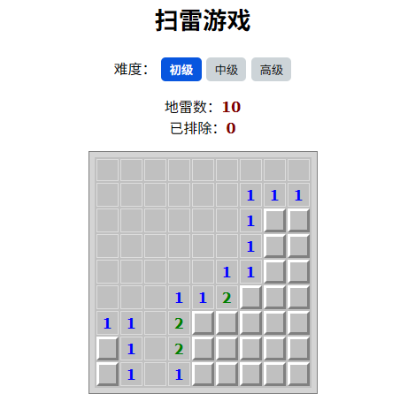
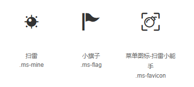
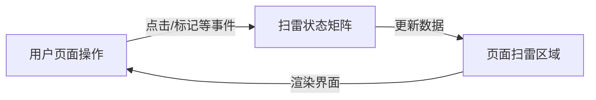
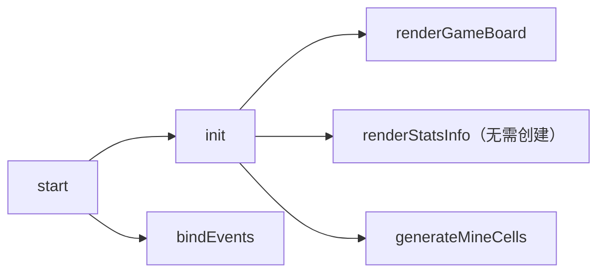

# DIY 实战：从扫雷小游戏开发再探问题分解能力

---

## 1 起因

最近在看去年刚出了第 2 版《**Learn AI-assisted Python Programming**》，梳理完 [第七章](https://blog.csdn.net/frgod/article/details/147366885) 的知识点后，总感觉这一章的话题很好——问题分解能力的培养——美中不足的是演示案例过于简单，有点意犹未尽。今天就用一个前端扫雷小游戏的全流程开发再来落地实操一回。

最终效果如下：



**图 1：前端扫雷游戏最终效果图**


## 2 思路分析

为了突出训练重点，这里将扫雷游戏略作简化，只保留核心功能：难度选择和扫雷操作，其他像计时、声音、排行榜等功能暂不考虑。因此整理后的需求描述如下：

1. 支持 “初级”、“中级”、“高级” 三种难度；
2. 记录每局总地雷数以及实时排雷数；
3. 根据选择的难度生成指定尺寸、固定地雷数的网格区域，通过左键探雷、右键标记地雷（不考虑 “待定” 标记）；
4. 探雷时：
   1. 如果踩到地雷则游戏结束；
   2. 为安全区域，则：
      1. 周围有雷：标记出周围 8 个单元格存在的地雷总数；
      2. 周围无雷：从当前单元格向四周扩散，直到发现标有地雷数的边界区域。
5. 排雷时，点击鼠标右键即可标记为雷区，之后左键无法单击继续；
6. 获胜条件：正确探明所有安全区域才算获胜（仅标注地雷不算胜出）。

那么按照上述需求，应该如何分类呢？每一局无论区域有多大，地雷有多少，都可以将整个界面剥离成两类问题：

1. 页面的渲染问题；
2. 页面元素的事件绑定问题；

接下来就围绕这两类问题进行讨论，看看问题分解如何发挥作用。


## 3 问题分解实战

根据刚才的思路分析，页面渲染和事件绑定存在明显的先后顺序和依赖关系：渲染出页面后才能绑定事件，并且绑定事件还需要知道每个单元格的状态（即地雷数据）。于是可以设计出如下两个子函数：

```js
let currentLv = 0;

function start(lv = currentLv) {
    // init game board
    const mineCells = init(lv);

    // bind events
    bindEvents(lv, mineCells);
}

start(currentLv);
```

在对这两个任务做进一步分解前，需要先准备好游戏需要的静态页面。


### 3.1 静态页面与基础样式

这一步包括 `HTML` 基本结构和 `CSS` 基础样式。选型时为了更灵活地设置样式，选用了 `iconfont` + 样式类来实现所有的单元格图案和标记：



**图 2：游戏界面用到的主要图标字体（来源：阿里图标库）**

使用方法：

```html
<!-- 引入样式 -->
<link rel="stylesheet" href="./iconfont.css">
<!-- 设置图标 -->
<span class="mine ms-xxx"></span>
```

具体图标从阿里图标库选取即可，这里不多赘述。对照最开始给出的页面效果，再上网找出经典扫雷游戏需要的基本效果，于是有了如下两个文件：

`index.html`：

```html
<!DOCTYPE html>
<html lang="en">
<head>
    <meta charset="UTF-8">
    <meta name="viewport" content="width=device-width, initial-scale=1.0">
    <title>Mine Sweeper Game</title>
    <link prefetch rel="stylesheet" href="assets/font/iconfont.css">
    <link async rel="stylesheet" href="assets/css/index.css">
    <link async rel="shortcut icon" href="assets/favicon.png" type="image/x-icon">
</head>
<body>
    <div class="container">
        <h1>扫雷游戏</h1>
        <section class="level">
            <span>难度：</span>
            <button data-level="1" class="active">初级</button>
            <button data-level="2">中级</button>
            <button data-level="3">高级</button>
            <button class="restart hidden">重新开始</button>
        </section>
        <section class="stats">
            <div class="score">地雷数：<span id="mineCount"></span></div>
            <div class="time">已排除：<span id="mineFound"></span></div>
        <section class="game">
            <table class="gameBoard"></table>
        </section>
    </div>
    <script src="assets/js/index.js" type="module"></script>
</body>
</html>
```

以及对应的样式文件 `index.css`：

```css
* {
    margin: 0;
    padding: 0;
    box-sizing: border-box;
    font-family: Verdana, sans-serif;

    --cell-size: 25px;
}

.container {
    margin-inline: auto;
    text-align: center;
}

h1 {
    font-size: 1.7rem;
    margin-block: 1rem;
}

.level {
    padding: .5em 0;

    &>button {
        padding: .3em .7em;
        border: none;
        border-radius: 5px;
        background-color: #cdd4d8;

        &.active {
            background-color: #0856df;
            color: #fff;
            font-weight: bold;
        }

        &.hidden {
            display: none;
        }
    }
}

.stats {
    padding: .5em;
}

#mineCount, #mineFound {
    font-weight: 700;
    color: maroon;
}

.gameBoard {
    border: 6px solid #d4d4d4;
    outline: 1px solid #808080;
    margin: 1em auto;
    background-color: #c0c0c0;
}

.cell {
    border-top: 3px solid #ffffff;
    border-left: 3px solid #ffffff;
    border-right: 3px solid #808080;
    border-bottom: 3px solid #808080;
    width: var(--cell-size);
    height: var(--cell-size);
    line-height: var(--cell-size);
    font-size: 1rem;
    cursor: pointer;

    &.invalid {
        background-color: violet;
    }

    &.mine {
        background: #c0c0c0;
        border: 1px solid #e4e4e4;

        opacity: 1;

        &.ms-mine {
            font-size: 1.2em;
            line-height: var(--cell-size);
            vertical-align: middle;
            color: #000;
        }

        &.ms-flag {
            font-size: 1em;
            line-height: var(--cell-size);
            vertical-align: middle;
            color: #f00;
        }

        &.ms-flag.correct {
            background: #6ad654;
        }
    }

    &.fail {
        background: #bb3d3d;
        border: 1px solid #808080;
        opacity: 1;
    }

    &.number {
        border-collapse: collapse;
        background: #c0c0c0;
        border: 1px solid #dddddd;
        font-weight: bold;
    }

    &.mc-0 {
        color: #c0c0c0;
    }

    &.mc-1 {
        color: #0000FF;
    }

    &.mc-2 {
        color: #008000;
    }

    &.mc-3 {
        color: #FF0000;
    }

    &.mc-4 {
        color: #000080;
    }

    &.mc-5 {
        color: #800000;
    }

    &.mc-6 {
        color: #008080;
    }

    &.mc-7 {
        color: #000000;
    }

    &.mc-8 {
        color: #808080;
    }
}
```


### 3.2 页面渲染逻辑

设计好了静态页面，接下来就可以安心拆解 `JavaScript` 核心逻辑了。

首先是 `init(lv)` 方法。该方法应该有三个基本任务：

1. 在页面中心位置加载出扫雷区域；
2. 页面统计指标（总地雷数、已探明雷数）均设为初始值；
3. 状态矩阵。

前两个不用多想，第三个任务要费点脑筋。这里绝不能将单元格的状态信息放入页面元素（例如 `data-*` 属性），否则打开 `F12` 调试工具就能轻松破解游戏。

因此必须单独维护一个与页面每个单元格绑定的 **状态矩阵**（即对象数组）。

这样一来，`init(lv)` 就可以拆分为以下三个板块：

```js
let mineFound = 0;
function init(lv) {
    // 1. create table elements
    const doms = renderGameBoard(lv);

    // 2. render stats info
    $('#mineCount').innerHTML = lv.mine;
    $('#mineFound').innerHTML = mineFound;

    // 3. create mine array
    const mines = generateMineCells(lv, doms);

    return mines;
}
```

由于中间那项过于简单，就不必另外创建函数实现了。这里需要再次拆分的是负责加载 `DOM` 节点的渲染函数 `renderGameBoard(lv)` 以及对应的状态矩阵生成函数 `generateMineCells(lv, doms)`。

要渲染单元格，既可以使用 `div` 也可以使用 `table` 表格，这里我倾向用 `table`，因为扫雷的整体风格感觉就像一个 `Excel`，而且单元格什么的也叫习惯了（哈哈）。到时候根据关卡对象 `lv` 拿到总的行列数与地雷数，就能批量生成扫雷区域了。

比较烧脑的是状态矩阵的数据结构：每个单元格要存放哪些信息呢？这一部分只能慢慢完善：

1. `id`：即 ID 编号。该编号值设置不仅要保持统一，更重要的是要明确制定一套转换公式，可以很方便地知道该 `ID` 值和页面单元格坐标（`(iRow, jCol)`）的对应关系（届时这些转换公式都放入单独的 `utils.js` 模块，以免干扰核心逻辑）。
2. `isMine`：即该单元格是否为地雷的定性标记；
3. `mineCount`：如果当前单元格不是地雷，则用它表示周围的地雷数，这样进行鼠标操作时就能直接显示，无需临时计算；
4. `flagged`：表示当前单元格是否被标为地雷，若已经标记，则该单元格不可再次点击，除非取消标记；

先暂定上述四个基本状态，后面需要增补再说。有了这样的数据结构，整个扫雷游戏的数据流就清楚了：用户通过各种操作触发状态矩阵的改变，状态矩阵再将变化情况更新到扫雷区域：



**图 3：扫雷基本数据流向示意图**

这样，`init()` 的拆分就暂告一个段落了，如下图所示：



**图 4 初步确定的 init() 函数拆分方案**


### 3.2 事件绑定逻辑