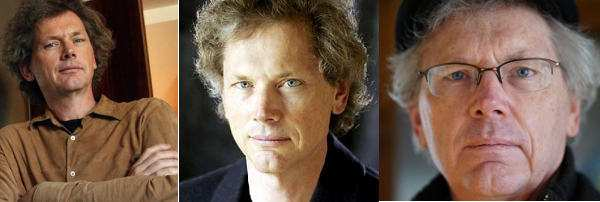

# 著名程序员 Bill Joy 的人生启示

---

上图是世界最著名的程序员之一：`Bill Joy`。

四十年前，他 20 岁出头，在加州大学柏克利分校读研究生，是 `Unix` 系统 `BSD` 版本的主要作者之一。因为找不到合适的编辑器，他用一个周末，在 `ex` 命令的基础上创造了 `vi` 编辑器。`Unix` 系统的 `TCP/IP` 协议也是他实现的。

28 岁时，他与其他人一起创建 `Sun` 系统公司，担任首席科学家，参与发明了 `Java` 语言。2003 年，49 岁时，他从 `Sun` 公司离职，改为从事风险投资。但是，他不投互联网公司，只投绿色能源，尤其是新型电池。原因是电动汽车大规模推广以后，地球上所有的锂元素制造电池都不够，必须找到新种类的电池。

我觉得，他的人生非常令人羡慕。不是因为取得的成就，而是因为每个人生阶段，他都在干不一样的事情：

- 年轻时是程序员
- 中年时是科学家
- 老年时是新能源企业家

美国总统特朗普也是这种情况：

- 年轻时是房地产商
- 中年时变成电视明星（[《学徒》](https://baike.baidu.com/item/学徒/10198638)一口气拍了十季）
- 老年时变成了总统

人生就好像一次旅行，不同时期能够从事不同的领域，就好像看到了不同的风景，体验了不一样的人生。

时代在变化，人生的可能性比任何时候都要多，真的没必要，一种职业干到老，多么单调的人生。实际上也不太可能，[有人统计](http://scholarsupdate.hi2net.com/news.asp?NewsID=23145) 2002 年的中国 500 强大企业，三分之二以上已经消失或没落了。那么大的公司都撑不久，何况个人呢？

我们在规划自己的人生时，应该有这种预见：总有一天，可能是每隔七年，我就会彻底离开现在的领域，在一个不一样的地方，干着自己感兴趣（理想的情况）或者不感兴趣（不理想的情况）的事情。

