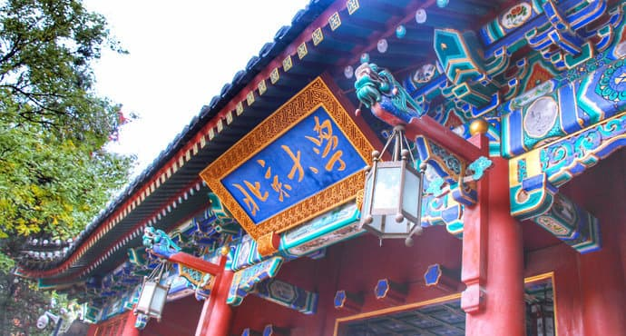
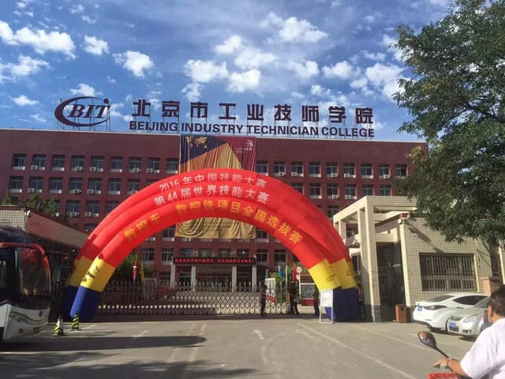
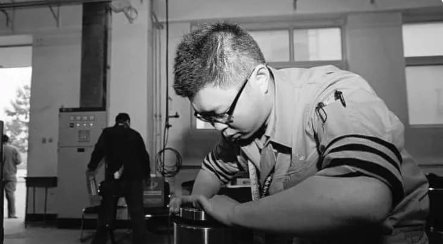
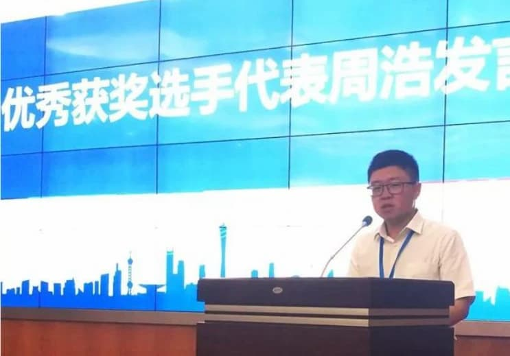

# 从北大到技校

最近，我看到一条[新闻](https://mp.weixin.qq.com/s/5ocKYYfHr1r4SC55ajkIWA)。十年前，有一个学生申请从北京大学转学去技校。十年过去了，他现在怎么样，媒体报道他的现状。

这个学生名叫周浩，从青海考入北大生命科学学院。大家知道，生命科学是学术性很强的一个专业，要学物理、化学、医学、生物化学等许多理论课程。周浩更喜欢动手，对那么多理论没有兴趣，入学第一年就跟不上课程了。

他想转专业去工科，但没有成功。他对继续读下去，丧失了信心，大一结束后，就申请休学一年，去深圳寻找出路。社会的闯荡让他意识到，没有一技之长很难立足。一年后，他回到北大，原以为会重新爱上学习，结果还是不适应。

这时他听说，德国的高中毕业生只有一半人读大学，还有一半人选择读职业学校，出路依然很好，这也是德国工业强大的一个原因。这给了他启发。2011 年冬天，他从北大退学，进入北京工业技师学院，从一名北大学生变成了数控机床的技工。

机床更符合他的兴趣，他如鱼得水，从零基础成长为数控机床的熟练工。2014 年第六届全国数控技能大赛的数控机床项目中，他获得了高技组全国第一名。

技校毕业以后，北京市化学工业集团把他作为高技能人才引进，解决了北京户口。现在，他在北京工业技师学院任教，是一名数控机床的青年教师。

那篇新闻报道的结尾处，赞扬了他选择合适自己的道路，但没有鼓励大家也走这条路。毕竟这是一个很冒险的举动，中国是一个看重文凭的社会，名校的光环对普通人有巨大的帮助，贸然放弃的损失很大。另外，你转学去技校，亲戚朋友和老师同学会怎么议论，别人会怎么看你，这是很大的心理压力。

在我看来，有一个最关键的点，报道里面没强调，那就是他最后选择的专业是数控机床，这大大减小了退学风险。中国制造业急缺数控机床人才，中国要成为"世界工厂"，离不开一大批机床专家。与其做一个平庸的北大毕业生，数控机床工程师有更好的前途和回报，更不用提幸福感的提升和个人兴趣的满足了。

**但是，这个故事真正打动我的地方，不是他选择哪一条道路，而是他敢于去选择，不跟现状妥协。** 那一种自己把握命运的主动性和勇气，我不能这样过下去，这不是我要的路，我必须改变人生的方向，然后毅然决然付诸行动。

太多的人缺乏这种勇气，让生活推着自己往前走，随波逐流。一个青年高中毕业，对自己、对社会都不太了解，选择大学专业都是听父母的，等到发现没有兴趣的时候，不知道该怎么办，往往选择先拿到文凭再说，得过且过。没有那种对命运负责的勇气和壮士断腕、破釜沉舟的行动力。

在中国，想要违逆命运安排好的道路，难度是极大的。周浩的退学是一个罕见的真实例子，拒绝命运的安排，听从自己的内心，做一个人生的逆行者。希望这个故事，能让更多的青年有做自己命运主人的勇气。

---

附新闻：周浩自诉

# 恪守专业技能梦，匠心独运铸光辉

——北京工业生产技师学院大学毕业生周浩在【全球青年人专业技能日主题风格】主题活动上的讲话

我是周浩，是来源于北京工业生产技师学院的一名骨干教师。

2012 年，我揣着着对数控加工中心技术专业的浓厚兴趣和期待，在许多人疑惑的眼光中，从北京大学撤出，转校到北京工业生产技师学院。在老师的领着下，我刻苦钻研基础理论，拆装机床，怀着不达到目标不罢手的信心，完成了两年技术员班的系统学习和训炼，完成了专业技能水准的飞快提高和全方位的发展。在 2014 年举行的第六届全国各地数控机床全国技能大赛数控车床装调与检修新项目中，我得到了职校组第一名。从数控专业技能零基础的学员发展为世界冠军，我终于在北京工业生产技师学院完成了我的专业技能成材梦。没忘记初衷，坚定理想信念，造就了今天的我。

如今，我已留校变成一名无上光荣的技工院校老师，并在北京化工集团公司、学校各个领导干部的关注下，作为高技能人才被引入北京市。真实经历尽管具备一定的独特性，但证实了一个大道理：只需坚定目标，坚持不懈，理想就会有很有可能完成！

「中国制造业 2025」发展战略的号角声早已奏响，「中国制造业」转为「中国智造」，召唤大量的高技能人才、优秀人才。在大家身旁，在高端装备制造生产制造行业，有得到中华民族专业技能巨奖的技能大师，有领着中国国家队在全球全国技能大赛上夺金的权威专家，更有为国增光的世赛参赛选手。可是这还还不够，国家发展还必须大量的青年技能人才担负起这一份义务，担负更高的重任。将来，我志向变成数控机床装调行业的高技能人才高层次人才，在技工院校这一高技能人才塑造的热土上，探寻服务项目高端装备制造生产制造产业链的青年人技能人才的发展方式！作为青年人技能的人才意味着，我将勇于担当技能人才塑造的重担，具体指导协助大量有兴趣爱好、有理想的青年人踏入专业技能成功之路。使我们青年人技能人才携手同行，贯彻和承传匠人精神，为完成中华文化伟大振兴的强国梦而勤奋努力！

（北京工业生产技师学院老师 周浩）