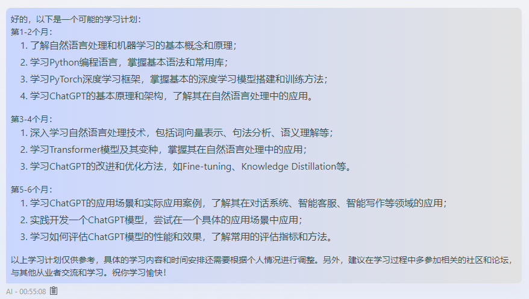

# 第二次对话摘录

假如现在想从事 ChatGPT 相关的工作，请制定一份详细的学习计划，时间6个月

> 好的，以下是一个可能的学习计划：
>
> 第1-2个月：
>
> 1. 了解自然语言处理和机器学习的基本概念和原理；
> 2. 学习Python编程语言，掌握基本语法和常用库；
> 3. 学习PyTorch深度学习框架，掌握基本的深度学习模型搭建和训练方法；
> 4. 学习ChatGPT的基本原理和架构，了解其在自然语言处理中的应用。
>
> 第3-4个月：
>
> 1. 深入学习自然语言处理技术，包括词向量表示、句法分析、语义理解等；
> 2. 学习Transformer模型及其变种，掌握其在自然语言处理中的应用；
> 3. 学习ChatGPT的改进和优化方法，如Fine-tuning、Knowledge Distillation等。
>
> 第5-6个月：
>
> 1. 学习ChatGPT的应用场景和实际应用案例，了解其在对话系统、智能客服、智能写作等领域的应用；
> 2. 实践开发一个ChatGPT模型，尝试在一个具体的应用场景中应用；
> 3. 学习如何评估ChatGPT模型的性能和效果，了解常用的评估指标和方法。
>
> 以上学习计划仅供参考，具体的学习内容和时间安排还需要根据个人情况进行调整。另外，建议在学习过程中多参加相关的社区和论坛，与其他从业者交流和学习。祝你学习愉快！

他所在的公司现在对NLP比较感兴趣，上述计划需要做进一步调整吗

> 如果他所在的公司对NLP比较感兴趣，那么可以在上述计划的基础上做一些调整，使其更加贴合公司的需求。以下是一些可能的调整：
>
> 1. 加强自然语言处理技术的学习，包括文本分类、情感分析、实体识别等，这些技术在NLP中应用广泛；
> 2. 学习BERT等预训练模型，掌握其在NLP中的应用，这些模型在NLP领域具有很高的应用价值；
> 3. 学习如何应用NLP技术解决实际业务问题，例如智能客服、舆情分析、文本生成等，这些应用场景与公司的业务相关，能够更好地帮助公司提升业务水平。
>
> 以上调整仅供参考，具体的学习内容和时间安排还需要根据公司需求和个人情况进行调整。另外，建议在学习过程中与公司的NLP团队进行交流和学习，了解公司的业务需求和技术架构，以便更好地为公司提供服务。

