# 大模型时代，得开发者生态得天下！

[CSDN学习](javascript:void(0);) *2023-10-26 18:03 发表于湖南*

以下文章来源于AI科技大本营 ，作者蒋涛

整理 | 王启隆

责编 | 袁滚滚  

出品 | CSDN（ID：CSDNnews）

“生态有大价值，大模型将开启开发者新生态，人人都是开发者、行行知识炼模型、软件工具全重构、智能应用百千万，希望能有更多朋友和开发者加入到新生态的建设中来。”

在数字时代的浪潮中，我们目睹了科技的迅猛崛起，与此同时，一个重大转变正悄然改变着我们的世界。如同一颗震撼的流星划破夜空，大模型时代已经降临。这是开发者的黄金时刻，也是全世界程序员的一次机会，大模型将技术的潜力推向了全新的高度，重新定义了开发者的角色以及数字经济的前景。

面对这些问题，CSDN 创始人&董事长、中国开源软件推进联盟副主席 **蒋涛** 在“**长沙·中国 1024 程序员节**”的“**2023 技术英雄会**”上带来了《大模型时代，得开发者生态得天下》的主题演讲，以下为亮点总结：

- **做生态是寂寞的，但生态有大价值，回报是丰厚的；**
- **大模型将掀起一场生态革命，带来生产力的极大提升，重构所有软件和应用，数字经济将发生彻底改变；**
- **大模型将开启开发者的新生态：人人都是开发者、行行知识炼模型、软件工具全重构、智能应用百千万；**
- **中国大模型正飞速发展，但基于大模型的应用才是构建生态的核心，我们的开发者正成为 AI 应用新生态的关键；**

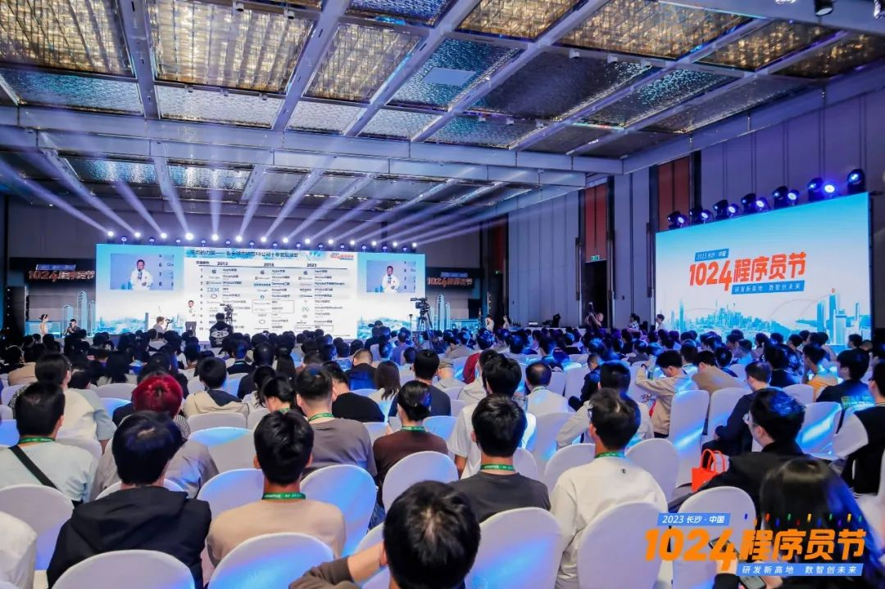

**直播回放：https://1024.csdn.net/**

成功的生态系统造就了万亿市值

**以下为蒋涛的演讲实录：**

尊敬的院士、各位专家和各位朋友，很高兴我们能再次相聚于 1024。回顾机器时代，我们曾将计算机视为一种工具，如今这一工具已经融入我们的生活，构建了更为复杂而生态丰富的系统。这也是我今日演讲的核心主题。我们正面临着焦虑、挑战和兴奋，思索同一个问题：**大模型的崛起将如何影响我们的未来？**

在探讨这一问题时，我们必须持续关注和推动生态系统的发展。我将其分为三个部分：

1. **生态的大价值；**
2. **AI 开发者生态报告发布；** 
3. **大模型新开启新生态。**

随着全球科技公司的发展，我们已经见证了过去十年的巨大变革。在 2013 年，移动互联网大爆发的时代，国内公司还未能跻身全球排行榜前十，第十名是知名的“苹果代工厂”富士康。到了 2018 年，腾讯、阿里等公司已经达到了三千亿美元市值，几乎与美国的互联网巨头旗鼓相当。当时，十大互联网公司里有四家中国公司，美国则占了六家。

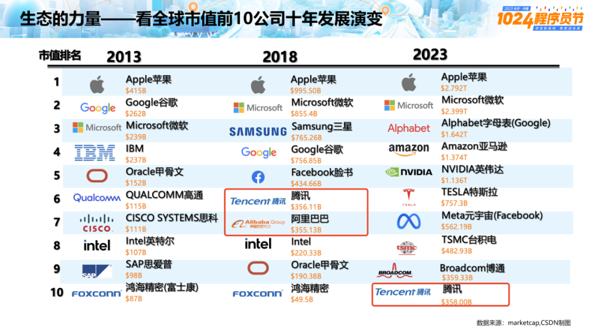

然而，五年后的 2023 年，美国科技公司迎来了巨幅增长，英伟达和特斯拉一蹴而就来到前排。这个现象的原因是多方面的，其中一个关键因素就是生态系统的建设。让我们以英伟达为例，它不仅仅是一家显卡或 GPU 制造商，还在软件等领域有巨大的影响，为互联网科技巨头提供了基础设施和服务。

CUDA 系统的成功是一个例子，它于 2007 年推出，旨在为 GPU 通用计算提供开发框架模型。值得一提的是，当时 CUDA 与 CSDN 有合作，这个合作是一路推动 CUDA 生态系统不断升级的重要一环。

然而，需要强调的是，CUDA 并非主要面向应用开发者，而是专注于底层和系统开发者。虽然在初期投入了巨额资金，但截至 2017 年，CUDA 的股票市值几乎没有变化，从 140 亿美元到 160 亿美元。这段时间的投资似乎有些冷清，但最终付出的耐心和坚持产生了三次显著的爆发。

首次爆发是因为矿机加密货币的兴起，GPU 被用于验证交易，创造了一个市值达七千亿美元的新兴市场。最近一次爆发则源自人工智能的蓬勃发展，CUDA 在这个领域发挥了巨大作用。因此，这一寂寞的投资最终转化为英伟达市值超过一万亿美元的辉煌成就。

CUDA 生态系统吸引了全球范围内超过 400 万的程序员，产生了超过 4 亿次的应用和下载，并与超过 3000 家紧密合作伙伴合作。这也告诉我们，**竞争不仅关乎产品本身，更是系统和生态的竞争**。

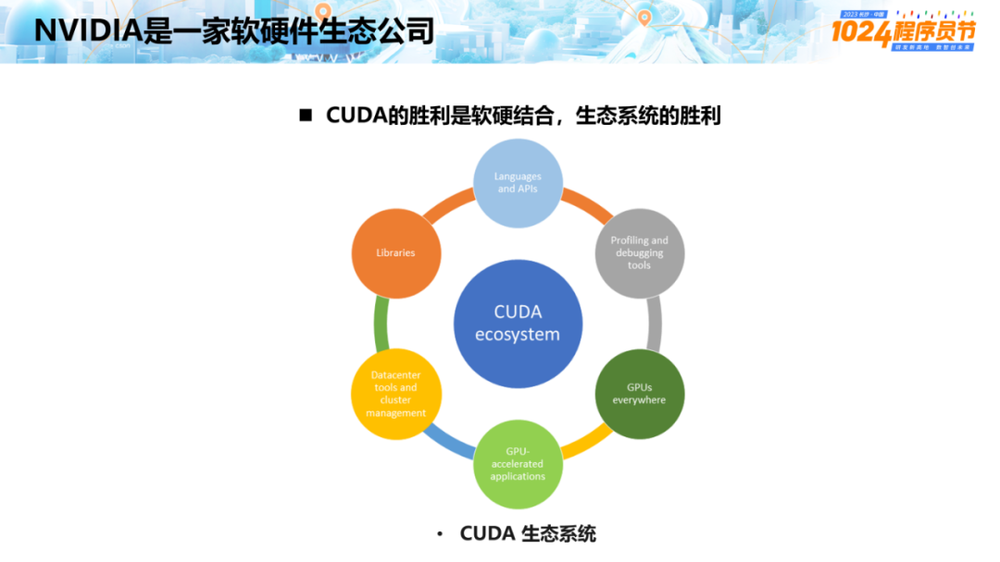

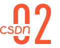

大模型将掀起一场生态变革

在老生态领域，竞争愈发艰难，因为其他公司已经投入几十年的时间。这就像传统燃油车领域，德国和日本一直占据领先地位，甚至韩国也早于我们进入市场。跟进这些老领域非常有挑战性。然而，在新能源汽车领域，我们取得了显著的进展，因为我们能够抓住新兴生态和技术平台的机会。

现在，我们再次面临一次机会，也就是人工智能和大模型的崛起。这些大模型具有巨大的潜力，去年 11 月 30 日发布后，它们以惊人的速度席卷全球，甚至让微软 CEO 发布公开信，宣告大模型将重塑软件和各行业，包括微软自身。

大模型的参数数量不断增长，这让它们能够高效压缩全球知识库，提供前所未有的智能。正如 OpenAI 的创始人 Sam Altman 所言，新时代的人工智能将带来巨大变革，从前的劳动力逐渐成本归零，所以他提出了一个“给所有人发钱”的方案。

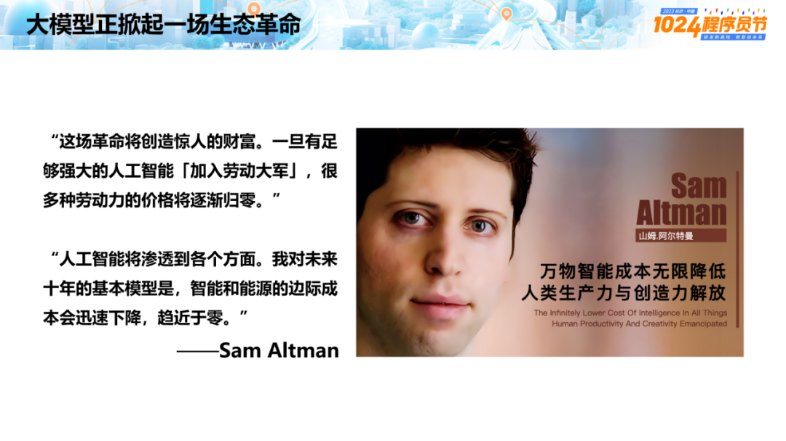

而顶尖专家如测试驱动开发的创始人 Kent Beck 认为，尽管过去的职业技能中有 90% 被淘汰，但剩下的 10% 却被放大了 1000 倍。这种共识正在推动各公司积极行动，中国已经拥有 130 个大模型，而美国也紧随其后。

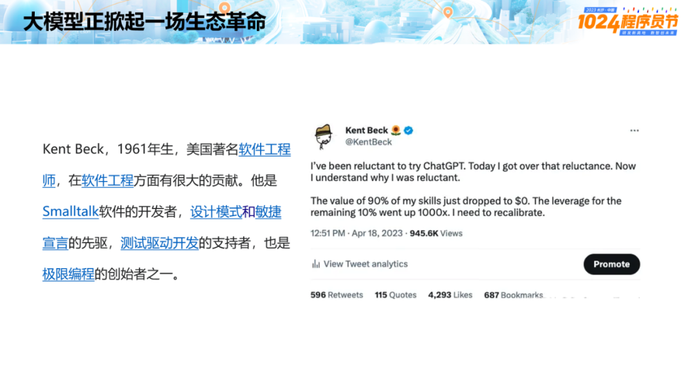

在前沿企业和专家中，已经形成了共识，即**大模型是未来的基础设施，将重构所有软件和应用，数字经济将发生彻底改变**。虽然现在它们有点像工业革命时期的“蒸汽机”，又贵又不好用，但这只是一个起点。**大模型是新一代的电网，当前还处在“蒸汽时代”，我们的“电器革命”才刚刚开始**。

今年，我们将发布一份开发者生态报告，对 AI 基础设施与服务、开发范式变化等方面进行了调研与思考，数据显示 GPU 的使用率已经达到 100%，已经渗透到各个开发领域。几乎每个企业都在每月消耗大量的 GPU 实例。超过 90% 的开发者表示通过大模型编写代码取得成功，85% 的人认为这提高了工作效率。

微软的报告甚至显示，使用大模型编写代码能提高 55% 的效率。除了 ChatGPT 和 GitHub Copilot 等工具广泛使用，Amazon CodeWhisperer 也成为了近期用户增速最快的 AI 编程工具。

开发者对代码生成的质量和速度高度关注，而且有 70% 以上的人表示愿意付费获取更好的服务。

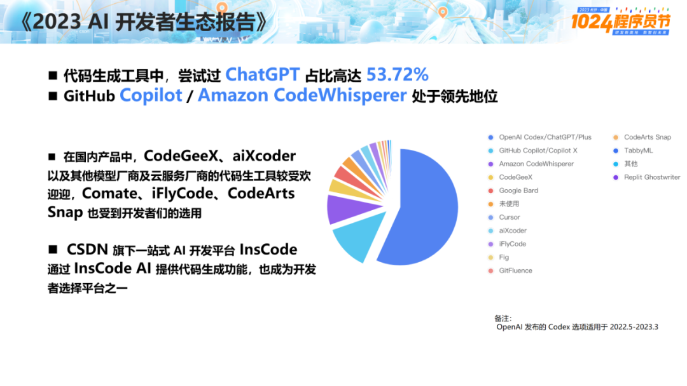

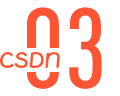

大模型开启开发者新生态

大模型要怎样开启开发者生态？我用四句话来解答：**人人都是开发者、行行知识炼模型、软件\**工具\**全重构、大模型时代新应用生态。**

首先，**人人都是开发者。**大模型赋能新开发者创造力 10-100 倍提升， 将带来开发人员数量的倍增。尽管我们有着庞大的人口，程序员却依然是稀缺的，中国有着 4.7 亿互联网用户，但真正掌握开发技能的人却相对有限。然而，随着大模型的兴起，开发会变得更加简单和容易，请看下面这段演示：

（时长02:26）

这完全是一种全新的开发范式，把我们的需求通过“自然语言”进行开发，让一个不会写代码的人也能开发出一个应用。从此以后，不仅是程序员的数量会增加，还会诞生许多新时代的“业务程序员”。

下图是 CSDN 与某基金公司合作的项目，他们主要专注于二级市场，需要大量行业、企业的分析数据，传统的低代码开发工具无法满足需求。现在，他们通过 CSDN 的 InsCode 工具提高了开发效率。未来的开发者的数量将会因大模型的蓬勃发展而迅速增长，他们需要更多的问题分析和解决能力，而不仅仅是编码技能。

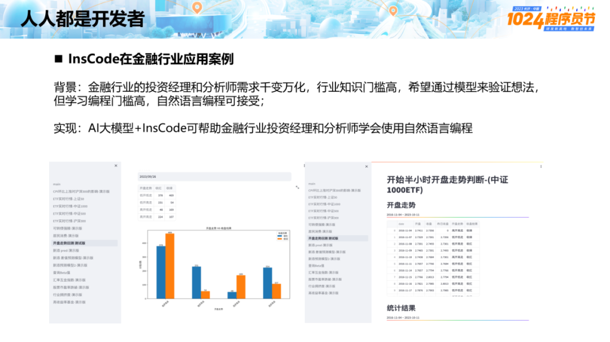

其次，**行行知识炼模型。**随着开源大模型的发展和行业数字化升级，开发者的数量将呈现倍增趋势，而企业基于私有数据的应用需求也将得到井喷释放；每个行业都需要自己的模型，需要开源数据和开源模型，开源模型技术平台成为各行业发展的核心基础。它们都可以基于其独特的知识和数据打造模型，这是各行业的核心基础设施。这些行业积累了大量的数据，然而，以往的系统往往脱离了人和机器、数据之间的联系。

随着大模型的出现，每个行业都相当于拥有一位顶尖专家，能够构建自己的模型。大模型开发生态使得“算力和算法”不再高不可攀，行业大模型、企业大模型将百花齐放。正如吴恩达（Andrew Ng）所说：“**过去没有被满足的 AI 行业应用将爆发**”。

以前，只有大公司能够承担 AI 工程师的高昂成本，但现在因为成本大幅下降许多企业和个人也能够利用这一能力，各行各业都在积极开发大模型。

第三，**软件工具全重构**。基于开源云原生和大模型的结合将重塑软件创造工具，这一市场在美国已经产生了 500 亿美元的价值，而中国有机会在新时代实现巨大发展。

未来的机会在大模型应用上，炼模型需要工具，中国尚缺乏这方面的生态工具。尽管我们已经取得了很多成就，但在大模型和工具的结合方面仍然滞后于美国。事实上，中国人做应用是最强的，但我们总是很难构建出完整的生态系统。

在大模型工具方面，其实不只是代码生成，还有许多各式各样的工具正在逐渐演化，而开发它们的都是美国公司。中国是多条 AI 赛道的全球领跑者，但基于大模型的 AI 工具链发展速度却慢了一步。

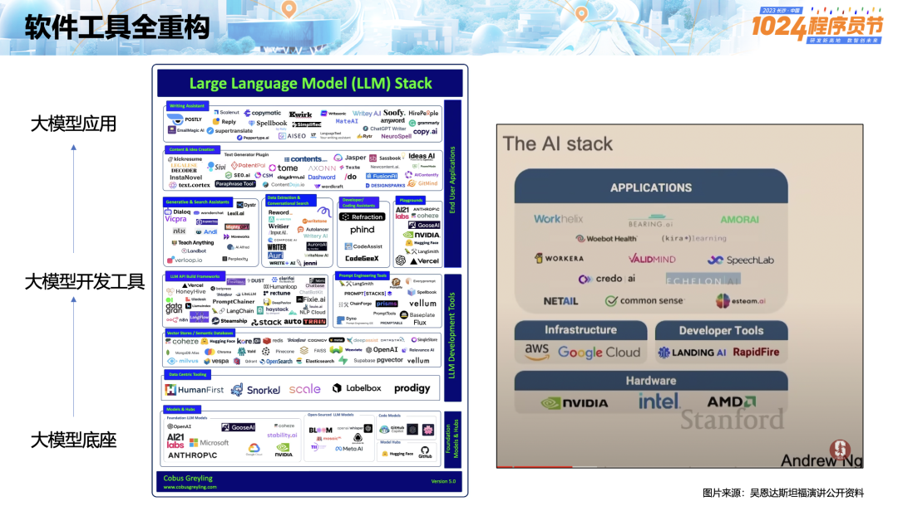

最后，**大模型时代新应用生态**。AI 技术将应用开发成本降到极低，过去程序员的年薪可能高达百万元，但现在几乎已经贬值成了“白菜价”，一块钱就可以调用 GPU，再花一块钱就能调用 API。这一变化释放了创造力和生产力，创造了各种各样的应用机会，也引发了投资热潮。美国已经开始大规模投资生成式 AI，AI 市场投融资占比高达 80%，全球投融资 220 亿美元，并在 2023 年达到近年高峰，比七年前提升了 160 多倍。

**基于大模型和开源框架，新一代应用将迅速崛起**。中国已经建立起了“百模千态”，有 130 多个大模型，许多大公司都在积极行动，因此我们实际上缺乏的就是大模型工具。百度就对此展开了迅速的行动，基于百度的应用生态推出了一系列 AI 原生应用，我自己也亲身感觉到百度的网盘还有文库都比原来添加了许多功能。

软件开发已从数字化时代迈向智能化时代，华为的 CodeArts Snap 顾名思义，可以让开发者打个响指（Snap）就能开发出应用。CSDN 也正在与华为合作，共同打造新的开源平台 **GitCode，赋能中国新一代开发者**。这是一个由 AI 驱动的开源生产力生态，以数据、云服务和人工智能技术驱动，能够支撑数百万应用在平台上稳定运行。

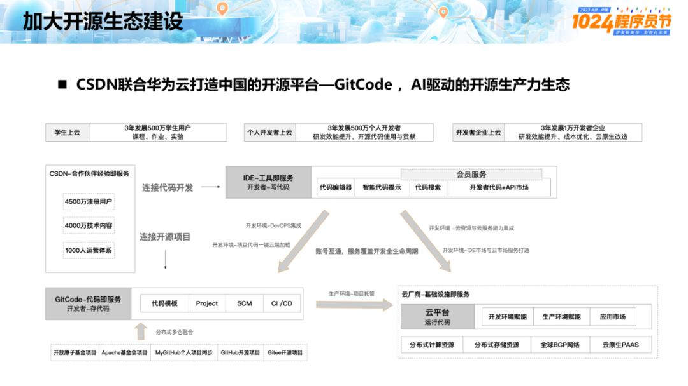

这种生态系统的价值是巨大的，许多前沿的公司和专家，都已经认识到生成式 AI 将带来巨大的产值。麦肯锡《生成式 AI 在中国：2 万亿美元的经济价值》中提到：“生成式 AI 是一个事实，每个开发者都在开发生成式 AI 应用，生成式 AI 有望为全球经济贡献约 7 万亿美元的价值，中国则有望贡献其中约 2 万亿美元。”

下图是我对未来新应用生态的规划。底座是开源的模型、数据和软件框架，而上层的应用者发生了变化，编程工具也不同以往。专业程序员的工作不再是编写功能性代码，所有的功能性代码都会被 API 化和大模型化，但这却能催生千行百业，真正创造和发展大经济时代。

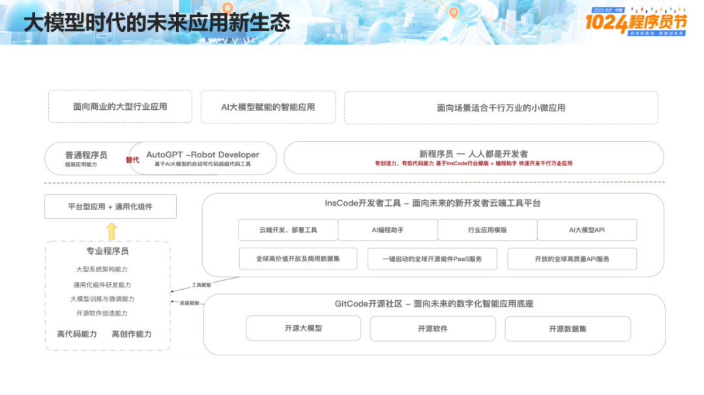

在大模型时代，拥有强大的开发者生态将成为关键。这是我们程序员的节日，希望能有更多的朋友和开发者加入我们，共同建设这个崭新的生态体系！

原文出处：https://mp.weixin.qq.com/s/mpG7CNftnVyE-ASu3Q7ERw