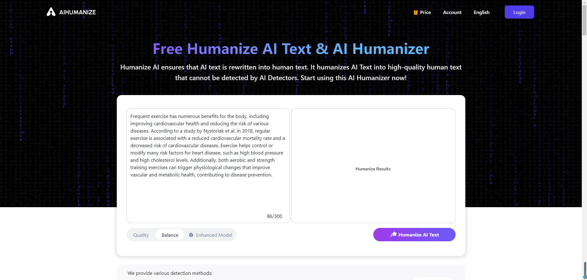
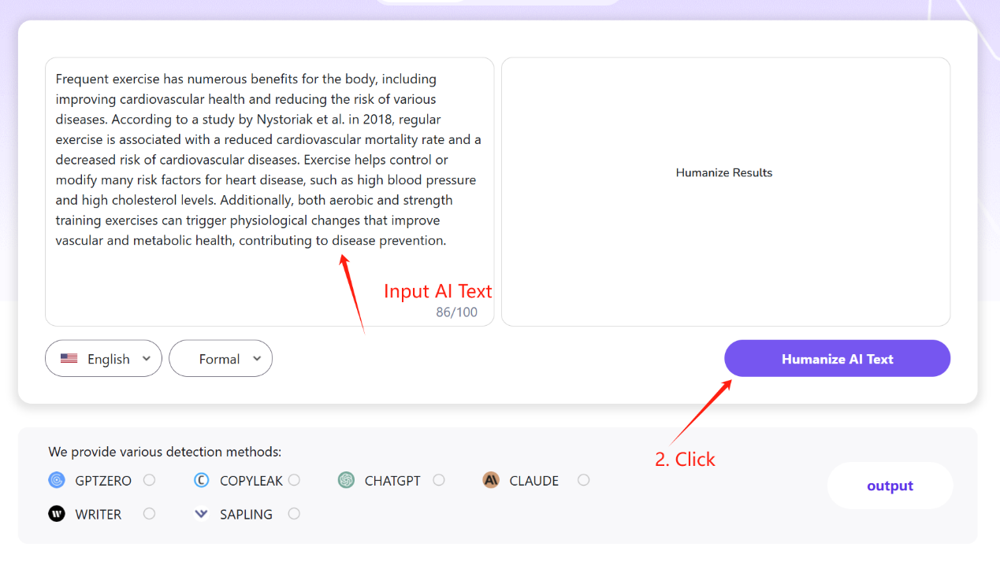

# Humanize AI 简介

## 1 [Humanize AI](https://www.aihumanize.io/) 是什么

数字时代的当下，AI 人工智能已成为内容创作不可或缺的一部分。从生成文章和论文，再到营销文案的制作，人工智能工具彻底改变了人们产生书面材料的方式。然而，一个重大挑战依然存在：人工智能生成的文字内容往往缺乏真人写作的自然气息，很容易被检测出是机器生成的。这就是 Humanize AI（字面含义即“人性化 AI”）这款产品的诞生背景。Humanize AI 是一款创新型工具，旨在将人工智能生成的文本转化为更贴近真人的内容，帮助用户绕开 AI 检测系统，以真实人类的方式呈现文本。

## 2 Humanize AI 能做什么

Humanize AI 服务于广泛的用户，每个用户都有独特的需求和挑战。下面一同走进 Humanize AI 的具体应用场景，看看它是怎样发挥作用的：

**学生**

对于学生而言，学术诚信的重要性再怎么强调也不足为过。但学生们往往面临着如何改写作业以避免抄袭的难题。无论是论文、研究报告还是作业，Humanize AI 都能帮助他们改写内容，使其听起来像是原创的人工撰写。这样既能确保他们的作品符合学术标准，又能避免抄袭的弊端。

 **作家和作者**

对于专业作家和作者来说，内容质量的把控也同样至关重要。他们需要自己的稿件能引起读者的共鸣、语句通顺、情感自然，行文流畅，并且可读性强。Humanize AI 可以改进他们写作的语法、语调和风格，使其更具吸引力和亲和力。该工具尤其适用于完善草稿，确保最终成品精益求精、贴合人性。

 **内容创作者**

博主、营销人员和社交媒体达人一直在努力制作引人入胜、听起来真实的帖子或博文。Humanize AI 可以将人工智能生成的初稿转化为能与受众产生个人联系的内容。无论是博客文章、社交媒体动态还是各类营销推广，Humanize AI 都能确保内容给人以真实感和亲切感。

 **企业**

在企业界，与客户进行有效沟通是建立牢固关系的关键。企业可以利用 Humanize AI 创建更个性化、更具亲和力的客户沟通模式。无论是电子邮件、新闻通讯、还是客服回复，Humanize AI 这款产品都可以帮助企业以类似真人的方式传达信息，从而提高客户的参与度及满意度。

## 3 Humanize AI 怎么用

使用 Humanize AI 非常简单。以下是一份分步指南，助您轻松上手：

1. **输入文本**：首先，将您要人性化的文本粘贴到 Humanize AI 平台上提供的文本框中。
2. **单击按钮**：输入文本后，只需单击 "人性化人工智能文本 "按钮。
3. **等待几秒钟**：该工具将处理文本，将其转换为可读的内容，就像人写的一样。这通常只需要片刻时间。
4. **获取结果**：很快就会收到 100% 类人化的翻新内容。然后就能将此文本投入正式使用，相信它将通过人工智能检测系统，并与您的受众产生共鸣。

## 4 Humanize AI 怎么收费

Humanize AI 提供了灵活的使用模式，旨在满足不同用户的需求。具体收费情况如下：

- **临时用户**：对于偶尔需要使用的用户，Humanize AI 每天提供多达五次免费使用。这非常适合只需要对少量文本进行人性化处理的用户。
- **注册用户**：通过注册帐户，用户每天可以获得额外的免费改写。这非常适合需要定期访问该工具的频繁用户。
- **订阅用户**：对于有高频使用需求的用户，Humanize AI 提供了专属订阅计划。订阅者可以访问高级模型并获得更多改写点数，确保他们始终拥有所需的资源。这些计划非常适合依赖 Humanize AI 满足内容创作需求的专业人士和企业。

##  5 结论

总之，[Humanize AI](https://www.aihumanize.io/) 是任何希望从 AI 人工智能生成的内容中获取类似真人文本的人的不二之选。无论您是希望保持学术诚信的学生、希望完善草稿的作家、追求真实性的内容创建者，还是希望改善客户沟通的企业，Humanize AI 都能满足您的需求。其易于使用的功能、灵活的使用选项和积极的用户反馈，使其成为数字内容创作领域的一个突出资源。

Humanize AI 可将人工智能生成的文本转化为自然、类似人类的内容，帮助您绕过人工智能检测系统，以真实的人类形象展示您的作品。立即访问 [Humanize AI](www.aihumanize.io) 亲身体验与众不同之处。与 Humanize AI 一起拥抱内容创作的未来，确保您的文本始终与受众产生共鸣。