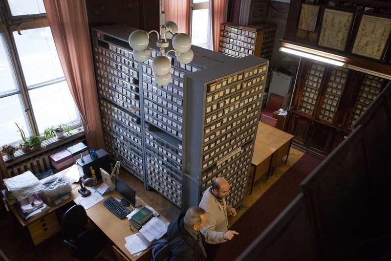
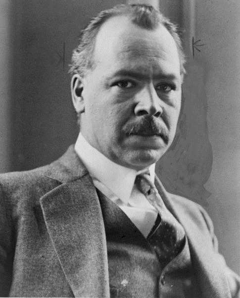
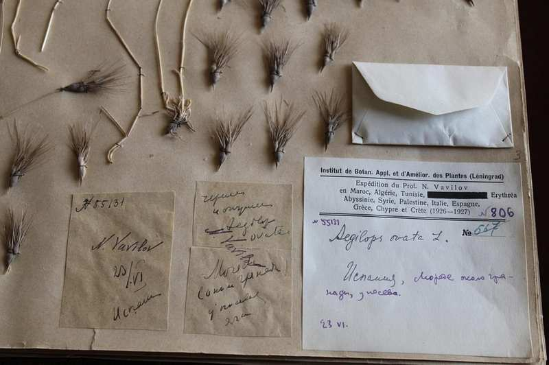
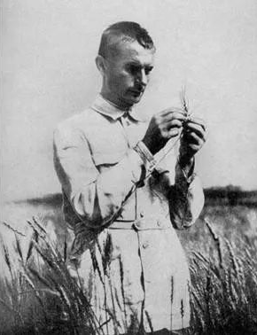
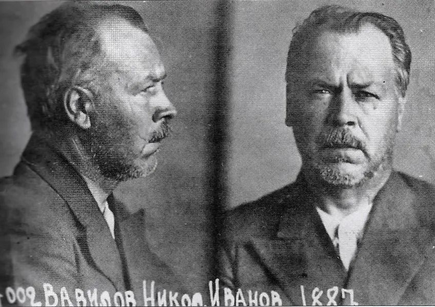
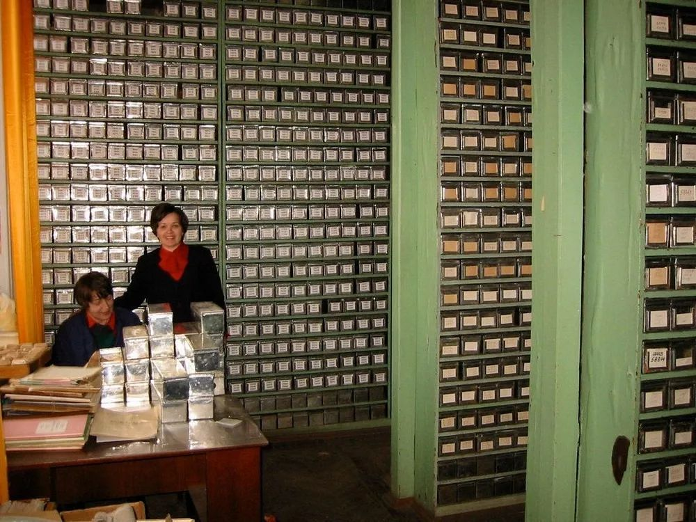

# 饿死在食物周围的科学家

from: [The Scientists Who Starved to Death Surrounded By Food](https://www.amusingplanet.com/2018/08/the-scientists-who-starved-to-death.html)

第二次世界大战，希特勒包围列宁格勒长达 900 天，切断了 200 万居民的所有食物供应，企图饿死俄国人。冬天的时候，成千上万的人饿死了。列宁格勒居民饿到吃木屑，许多人试图在零下 30°C 的天气里步行几公里到食品配送亭，结果冻死在路上。

*Inside the Vavilov Institute of Plant Industry*

当时，列宁格勒瓦维洛夫植物研究所藏有近 20 万种植物的种子，其中约四分之一可食用，是世界上最大的粮食作物遗传多样性库之一。其中有大量的大米，小麦，玉米，豆类和土豆，足以支撑研究所的植物学家吃饱。但是，科学家们并没有用食物来挽救自己的生命，而是保护这些种子不受纳粹以及街头寻找食物的人们的破坏。

科学家全天候轮流保护着仓库，冷得麻木，饥饿消瘦。随着围困时间越来越长，他们一个接一个地开始饿死，但至死没有吃过一粒研究所的种子。1942 年 1 月，花生专家 Alexander Stchukin 在写字台上去世。植物学家德米特里·伊万诺夫（Dmitri Ivanov）也死于饥饿，他的周围是数千包大米种子。1944年春天，德军撤退时，有 9 人已经饿死。

*Nikolai Vavilov in 1933*

这个种子库是世界第一个植物多样性种子库。它由俄罗斯最杰出的植物学家和遗传学家尼古拉·瓦维洛夫于 1926 年建立。他是首批预见植物多样性消失的科学家之一，并认识到这可能对粮食生产造成灾难性影响。瓦维洛夫在一个贫困的乡村长大，饱受经常性的作物歉收和食物配给困扰，从很小的时候就开始痴迷于他的祖国俄罗斯和世界的饥荒。20 世纪早期，他在五大洲进行了广泛的访问，共访问了 64 个国家，收集了各种植物和粮食作物标本。他自学了 15 种语言，以便与当地农民交谈。经过近十年的旅行和数百次旅行后，成立了列宁格勒植物研究所。

下图是瓦维洛夫制作的种子标本。

*Specimens collected by Nikolai Vavilov displayed at the Vavilov Institute of Plant Industry*

当瓦维洛夫收集种子并建立种子库以保护后代的食物多样性时，一位名叫特罗菲姆·李森科（Trofim Lysenko）的年轻农学家被苏联宣传机器誉为天才，他开发了一种新的革命性农业技术，可以拯救人类 国家免于饥饿。 实际上，自 1850 年代以来，李森科 (Lysenko) 的技术包括将作物置于严寒中以迫使它们在春季开花，这一技术被称为春化处理。 众所周知，春化仅产生略微增加的粮食产量，而不是李森科声称的三到四倍。 李森科还声称春化状态可以由后代继承。

*Trofim Lysenko*

作为政治机会主义者，李森科很快得到了约瑟夫·斯大林的青睐。 在苏联媒体夸大他的成功并压制他的失败的支持下，李森科开始捏造实验数据来支持他的理论，并谴责任何试图反对他的方法的人。 从 1934 年到 1940 年，在李森科的劝告和斯大林的批准下，超过 3,000 名生物学家和遗传学家因企图反对李森科而被监禁、解雇或处决。

1940 年 8 月，瓦维洛夫正在俄罗斯和东欧的边境地区收集种子，一辆装有克格勃特工的汽车开过来将他带走。 他被判处二十年监禁在苏联古拉格。 在吃了一年半的冷冻卷心菜和发霉的面粉后，尼古拉·瓦维洛夫（Nikolai Vavilov）——这位教我们农业多样性和植物起源的人，他用了五十年的生命试图结束饥荒——死于饥饿。

“在瓦维洛夫绘制植物多样性中心地图之前，没有科学家亲身体验过并在智力上掌握了整个地球表面的生物多样性模式，”《我们的食物来自哪里：追溯尼古拉·瓦维洛夫结束饥荒的探索》一书的作者加里·保罗·纳布汉写道。 “由于他能够乘火车、船、飞机、汽车和骡子旅行，瓦维洛夫不仅亲眼目睹了其他科学家从未涉足的自然和文化景观，而且他还将它们吸收到我们今天仍然存在的生物地理学理论中。”

巴甫洛夫斯克实验站现在拥有超过 325,000 个种子样本，包括世界上最大的水果和浆果收藏。 其中包括近千种草莓，约 600 种苹果，以及百余种醋栗、樱桃、李子、红醋栗和覆盆子。 大约 90% 的收藏品在世界上没有其他科学收藏品中被发现。 今天，它只是当今全球 1,400 个种子库之一，其中最雄心勃勃的是位于挪威斯匹次卑尔根岛上的斯瓦尔巴全球种子库，距离北极仅 700 英里。

Nikolai Vavilov's mugshot as a prisoner. Several deep scars on his right cheek indicate the severe beatings sustained by the scientist in prison.
尼古拉·瓦维洛夫 (Nikolai Vavilov) 作为囚犯的面部照片。 他右脸颊上的几道深深的伤疤表明这位科学家在监狱中遭受了严重的殴打。 

The seed collection at Vavilov Institute of Plant Industry in 2002
2002年瓦维洛夫植物工业学院收集的种子样本